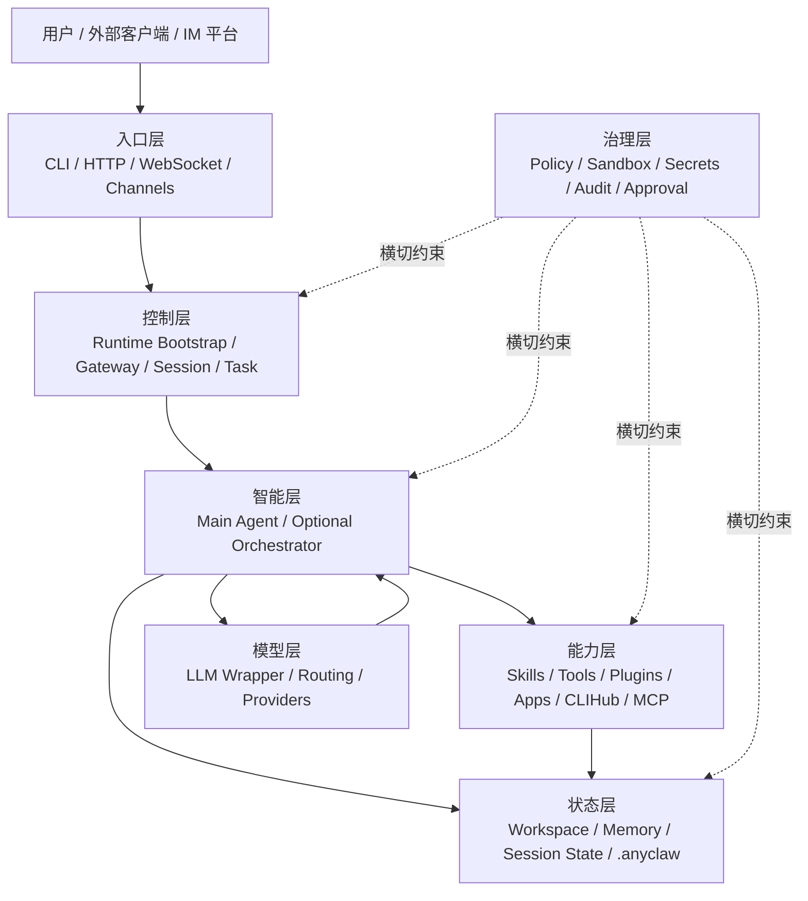
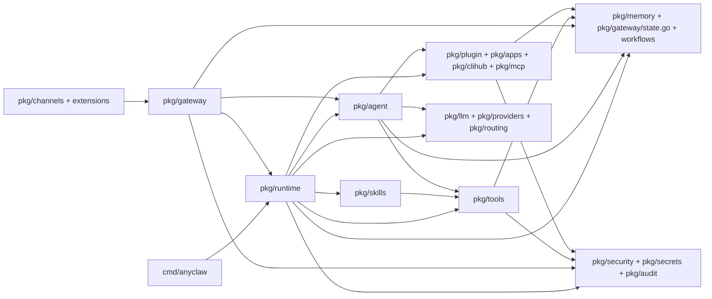
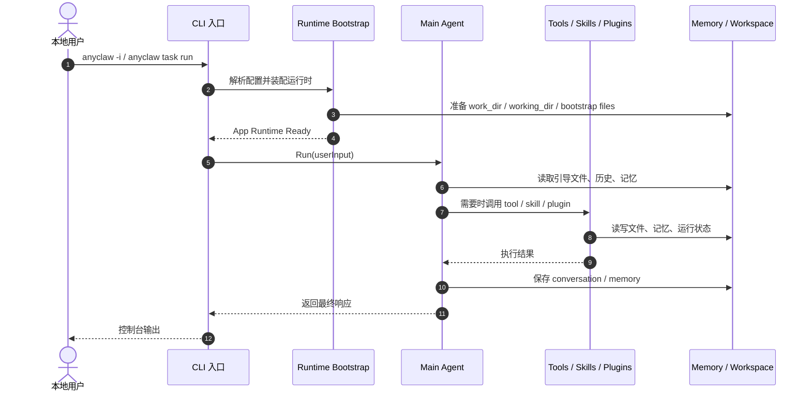
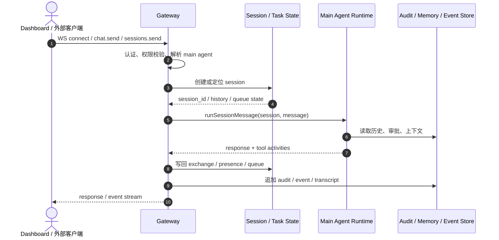
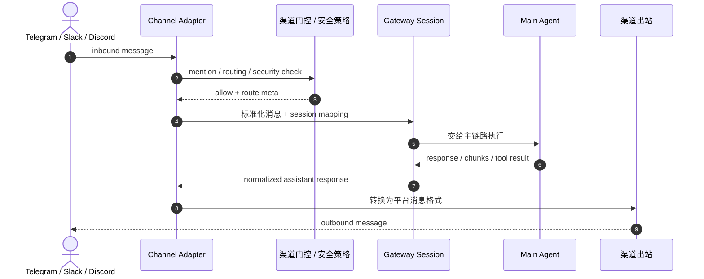
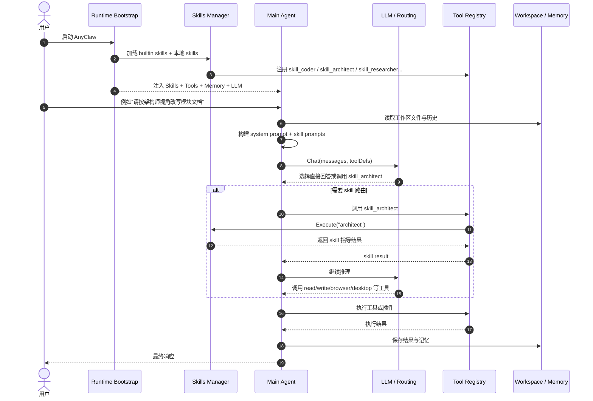

# AnyClaw 模块级架构文档（导师汇报版）

> 视角：项目作者向导师汇报  
> 基线：当前仓库实现（`cmd/anyclaw/`, `pkg/runtime/`, `pkg/gateway/`, `pkg/agent/`, `pkg/skills/`, `pkg/tools/`）  
> 更新时间：2026-04-10  
> 当前版本：`2026.3.13`  
> 说明：本文不是按目录树做“代码导览”，而是按“汇报摘要 -> 背景 -> 目标 -> 概要设计 -> AnyClaw 架构 -> 子模块设计 -> OpenClaw 与 AnyClaw 差异 -> 修改演示”组织。  
> 我希望这份文档先向导师回答三个问题：
> 1. 我为什么要做 AnyClaw。
> 2. 我为什么这样设计，而不是用更简单或更常见的做法。
> 3. 这套设计目前已经落到了哪些工程实现上。

## 0. 汇报摘要

如果用最短时间向导师汇报，我会先讲四点：

1. **项目定位**
   AnyClaw 不是单纯的聊天机器人，而是一套本地优先、可执行、可扩展、可治理的 Agent 工作空间。它的目标是复刻 OpenClaw 的主体验，但在工程实现上采用 Go 运行时，强调本地执行和系统可控性。
2. **核心问题**
   现有很多 Agent 系统要么只会“对话”，不会“执行”；要么能执行，但能力分散、状态不统一、治理薄弱。尤其在 skill、工具、应用连接器和控制面之间，经常缺少统一主链路。
3. **核心方案**
   我把 AnyClaw 设计成“Main Agent 统一决策，Runtime 统一装配，Gateway 统一控制，Skills / Tools / 插件与应用连接器能力统一暴露，Memory / Audit / Approval 统一落地”的六层架构。
4. **当前成果**
   从代码实现看，AnyClaw 已经完成了运行时装配、OpenClaw 风格 Gateway、内置 skill 注册、Main Agent 工具循环、Session / Task 状态管理，以及多种本地执行能力的接入。因此这份架构文档不是空想，而是对现有系统的抽象总结与答辩表达。

## 1. 背景

### 1.1 业务背景

从项目作者视角看，我做 AnyClaw 的出发点，不是再做一个“能聊几句”的 AI CLI，而是想做一套真正能落地执行的本地 Agent 工作空间。  
这个出发点来自三个现实观察：

1. 真实用户任务不是单纯问答，而是“理解任务 + 调工具 + 改文件 + 查资料 + 落结果”。
2. 一旦系统进入真实执行场景，状态管理、权限控制、审计与恢复能力就和模型能力同样重要。
3. 如果 skill、tool、plugin、app connector 之间没有统一主链路，系统会越来越像一堆功能拼盘，而不是一个可维护的工程系统。

因此，AnyClaw 需要同时满足以下几类诉求：

1. 用户可以像使用 OpenClaw 一样，从 CLI、Dashboard、WebSocket、消息渠道进入系统。
2. 系统不止回答问题，还要能调用本地文件、命令、浏览器、桌面、插件和应用连接器能力完成任务。
3. skill 不应只是一个说明文件目录，而应成为 Main Agent 可以理解、可以路由、可以组合的系统能力。
4. 所有执行过程都要有本地状态、审计、权限和审批支撑，适合真实工程环境。

### 1.2 架构背景

当前仓库已经具备这些关键基础：

1. `pkg/runtime/` 已经能按阶段装配配置、工作区、记忆、skills、tools、plugins、LLM、Agent。
2. `pkg/gateway/` 已经提供 OpenClaw 风格的控制面，并支持 `openclaw.gateway.v1` 风格的 WebSocket 方法集合。
3. `pkg/skills/` 已经支持内置 skill 和磁盘 skill，并能统一注册成 `skill_*` 工具。
4. `pkg/agent/` 已经具备 Main Agent 的 Prompt 构建、工具循环、上下文压缩、工具选择和自动路由能力。
5. `pkg/tools/` 已经把文件、命令、浏览器、桌面、记忆、CLIHub 等能力统一收口到 Registry。

这意味着：AnyClaw 在工程实现上已经具备复刻 OpenClaw 主体验的基础，缺的不是零件，而是更清晰的架构叙事和模块边界表达。

### 1.3 问题定义

如果把这个项目抽象成一个研究或工程问题，我认为它本质上在解决四个矛盾：

1. **多入口与统一主链路之间的矛盾**  
   用户可能从 CLI、WebSocket、Dashboard、IM 渠道进入系统，但系统内部不能因为入口不同就出现多套执行逻辑。
2. **通用智能与具体执行之间的矛盾**  
   Main Agent 负责理解任务，但真正落地时又要依赖 skill、tool、plugin、应用连接器能力、CLI harness 等具体能力。
3. **灵活扩展与工程可控之间的矛盾**  
   系统既要开放扩展，又不能因为扩展而失去可治理性、可追踪性和安全边界。
4. **OpenClaw 体验复刻与 AnyClaw 本地化实现之间的矛盾**  
   我希望用户感受到类似 OpenClaw 的使用心智，但工程实现必须适合 Go、本地执行和单二进制部署。

## 2. 目标

### 2.1 总目标

AnyClaw 的架构目标可以概括为一句话：

在 Go 的本地优先运行时中，复刻 OpenClaw 的主体验，并把内置 skill 升级为 Main Agent 的一等能力。

展开来看，包含四个层次：

1. 复刻 OpenClaw 的使用心智。
   包括 CLI 入口、Gateway 控制面、Session / Task 模型、WebSocket 协议、渠道接入、主代理统一接单。
2. 强化 AnyClaw 的本地执行能力。
   包括文件、命令、浏览器、桌面、插件、应用连接器、CLIHub、MCP。
3. 把 skill 从“配置资源”升级成“可路由能力”。
   skill 既要参与 Prompt 注入，也要通过 `skill_*` 工具暴露给 Main Agent。
4. 保持系统治理和工程可控性。
   包括状态落地、记忆、审批、审计、策略、沙箱、Secrets。

### 2.2 成功标准

如果这套架构成立，系统应满足以下标准：

1. 用户无论从 CLI、Gateway、Channel 哪个入口进入，最终都落到同一条 Main Agent 主链路。
2. 内置 skill 在启动后自动可用，不需要额外安装即可参与 Prompt 和工具调用。
3. Main Agent 能按任务语义决定是直接回答、调用 `skill_*`、调用本地工具，还是转入插件或应用连接器能力。
4. Session、Task、Event、Memory、Workspace 文件都有稳定落点，便于恢复、回放和排障。
5. 工具执行、插件执行和危险操作有统一的权限与审计控制。

### 2.3 非目标

本文不把以下内容作为当前主目标：

1. 不追求 1:1 复制 OpenClaw 的全部实现细节。
2. 不要求所有路径都必须经过多代理编排，Main Agent 仍然是默认主路径。
3. 不把 UI 细节或前端展示层作为本文件重点，本文聚焦运行时和模块架构。

## 3. 概要设计

### 3.1 设计原则

AnyClaw 的概要设计遵循以下原则：

1. 单入口，多传输。
   CLI、HTTP、WebSocket、Channel 都是入口，但都应收敛到统一执行主链路。
2. 运行时先于业务。
   先解决装配、生命周期、状态、权限，再谈推理与执行。
3. Main Agent 统一决策。
   用户心智上只有一个“主代理”，多能力和多模块都围绕它展开。
4. Skill 与 Tool 双态并存。
   skill 既是 Prompt 资产，也是 Tool 资产。
5. 状态、治理、本地执行同等重要。
   任何“会执行”的能力，都必须同时考虑状态落地和安全治理。

从作者视角看，这五条原则并不是写在纸面上的口号，而是我在实现过程中反复用来做取舍的判断标准。  
只要某个新能力破坏了“统一主链路、统一状态、统一治理”这三件事，我就不会把它作为系统一级能力接入。

### 3.2 总体分层图



### 3.3 工程接线图

这张图强调“代码如何接起来”，而不是概念分层：



### 3.4 启动装配概要

`pkg/runtime.Bootstrap` 是整个系统的工程总装配器。当前主链路可以概括为：

1. 加载配置与默认 Provider/Profile。
2. 初始化 Secrets Store / Secrets Manager。
3. 准备 `work_dir`、`working_dir`、workspace bootstrap 文件和 memory backend。
4. 加载内置 skill 和本地 skill。
5. 注册内置工具和 `skill_*` 工具。
6. 加载插件、App、CLIHub、MCP 相关能力。
7. 初始化 LLM 与模型路由。
8. 创建 Main Agent，并把 Skills、Tools、Memory、Config 注入进去。

### 3.5 核心结构体与接口总览

| 结构体 / 接口 | 所在模块 | 作用 |
|---|---|---|
| `config.Config` | `pkg/config/types.go` | 统一承载 LLM、Agent、Skills、Gateway、Plugins、Security、Sandbox 等总配置 |
| `runtime.BootstrapOptions` | `pkg/runtime/runtime.go` | 控制运行时如何初始化 |
| `runtime.App` | `pkg/runtime/runtime.go` | 运行时总容器，持有 Agent、Skills、Tools、Plugins、Memory、Audit 等核心组件 |
| `agent.LLMCaller` | `pkg/agent/agent.go` | Main Agent 调用模型的统一接口 |
| `agent.Config` | `pkg/agent/agent.go` | Main Agent 的注入配置 |
| `agent.Agent` | `pkg/agent/agent.go` | 单 Agent 主执行器 |
| `skills.Skill` | `pkg/skills/skills.go` | skill 的元数据、prompt、权限、entrypoint 定义 |
| `skills.SkillsManager` | `pkg/skills/skills.go` | 统一加载、过滤、注册、执行 skills |
| `tools.BuiltinOptions` | `pkg/tools/tools.go` | 注册内置工具时的执行上下文与治理配置 |
| `tools.Registry` | `pkg/tools/registry.go` | 统一注册、列举、调用工具 |
| `gateway.Server` | `pkg/gateway/gateway.go` | HTTP / WS 控制面总入口 |
| `gateway.Session` | `pkg/gateway/state.go` | 会话状态模型 |
| `gateway.Task` | `pkg/gateway/state.go` | 任务状态模型 |
| `plugin.Registry` | `pkg/plugin/plugin.go` | 插件、App 插件、Channel 插件注册中心 |
| `apps.Store` / `apps.Binding` | `pkg/apps/store.go` | App bindings / pairings / UI map 本地存储 |
| `clihub.Catalog` | `pkg/clihub/catalog.go` | CLI-Anything catalog 结构 |
| `mcp.Server` | `pkg/mcp/server.go` | 对外暴露 MCP tools/resources/prompts 的服务端结构 |

### 3.6 新能力如何接

| 目标能力 | 主要接入点 | 接入方式 |
|---|---|---|
| 新增内置 skill | `pkg/skills/builtins.go` | 新增 builtin seed，运行时加载后自动进入 `SkillsManager`，并注册成 `skill_*` |
| 新增本地 skill | `skills/<name>/skill.json` 或 `SKILL.md` | `SkillsManager.Load()` 自动扫描，必要时通过 entrypoint 执行 |
| 新增内置 tool | `pkg/tools/tools.go` + `pkg/tools/*.go` | 在 `RegisterBuiltins` 中接入，并通过 `Registry.RegisterTool` 注册 |
| 新增 Gateway WS 方法 | `pkg/gateway/ws.go` | 补 `openClawWSMethods`，在 `handleRequest` 中加 case |
| 新增 Gateway REST 接口 | `pkg/gateway/gateway.go` | 在 `Server.Run()` 中注册 route，并增加 handler |
| 新增消息渠道 | `pkg/channels/` 或 `extensions/` | 实现渠道适配器，接入 Gateway session 主链路 |
| 新增插件 / App 插件 | `plugins/` + manifest | 通过 `plugin.NewRegistry` 扫描并由 `RegisterToolPlugins` / `RegisterAppPlugins` 挂入 |
| 新增 CLIHub 能力 | `CLI-Anything-0.2.0/registry.json` | `clihub.LoadAuto()` 发现目录并暴露 catalog / exec 能力 |
| 新增 MCP tool | `pkg/mcp/server.go` | 调用 `RegisterTool` / `RegisterPrompt` / `RegisterResource` 暴露给外部系统 |
| 新增运行时服务 | `pkg/runtime/runtime.go` + `runtime.App` | 在 Bootstrap 指定阶段初始化，并把实例挂到 `runtime.App` 中 |

### 3.7 关键设计取舍

这一节是我认为导师最值得关注的部分，因为它解释了“为什么这样设计”。

#### 3.7.1 为什么保留 Main Agent 作为统一入口

我没有把 AnyClaw 设计成“每种能力各自直连”的系统，而是坚持让 Main Agent 作为统一决策入口，原因有三点：

1. 用户只需要理解一个主体，不需要区分当前到底是 skill、plugin 还是 tool 在工作。
2. 所有上下文，包括历史、记忆、工作区文件、审批结果，都能统一汇总到 Main Agent 的推理上下文中。
3. 后续即使引入多代理编排，Main Agent 仍然可以作为总控，而不是推翻现有主链路。

#### 3.7.2 为什么要有 Runtime Bootstrap，而不是各模块自行初始化

我把系统初始化集中在 `runtime.Bootstrap` 中，是因为：

1. 运行时组件之间存在明确的先后依赖，例如 memory 依赖工作目录、skills 依赖配置、tools 依赖 policy 和 sandbox。
2. 如果每个模块自行初始化，CLI、Gateway、TaskManager 很容易拼出不一致的运行时。
3. 统一装配使得系统更适合做进度观测、失败定位和灰度扩展。

#### 3.7.3 为什么要兼容 OpenClaw 风格 Gateway

我没有单独发明一套完全新的控制协议，而是兼容 OpenClaw 风格的 Gateway / WS 方法集合，主要基于三点考虑：

1. 这能降低用户和前端控制面的理解成本。
2. 它有利于系统从一开始就具备 session / task / events 的平台化视角。
3. 在保留熟悉心智的同时，AnyClaw 仍然可以在内部实现上保持 Go 和本地优先的取向。

### 3.8 项目特色与创新点

如果从导师评审视角总结，我认为 AnyClaw 当前有五个比较明确的架构特色：

1. **OpenClaw 使用心智与 Go 本地运行时的结合**  
   用户侧体验借鉴 OpenClaw，但工程侧强调本地优先和单二进制。
2. **内置 skill 编译进运行时**  
   这使得 skill 不再只是外挂资源，而是 Main Agent 的原生能力。
3. **skill、tool、插件与应用连接器的分层协同**  
   skill 负责认知，tool 负责执行，插件与应用连接器负责承接具体软件能力。
4. **Gateway、Session、Task、Audit 的统一控制面**  
   让系统既能聊天，也能像平台一样管理任务生命周期。
5. **治理能力与执行能力同时设计**  
   Policy、Sandbox、Secrets、Approval 不是后补功能，而是主链路的一部分。

## 4. AnyClaw 架构

从总体上看，AnyClaw 可以分成六层：

| 层次 | 核心组成 | 作用 |
|---|---|---|
| 入口层 | `cmd/anyclaw/`, `pkg/gateway/`, `pkg/channels/` | 接收 CLI、HTTP/WS、IM 渠道请求 |
| 控制层 | `pkg/runtime/`, `pkg/gateway/` | 启动装配、创建 Session、维护任务生命周期 |
| 智能层 | `pkg/agent/`, 可选 `pkg/orchestrator/` | Main Agent 推理、工具循环、可选多代理编排 |
| 能力层 | `pkg/tools/`, `pkg/skills/`, `pkg/plugin/`, `pkg/apps/`, `pkg/clihub/`, `pkg/mcp/` | Skill、Tool、Plugin、App、CLI、MCP 能力执行 |
| 状态层 | `pkg/memory/`, `pkg/gateway/state.go`, `workflows/`, `./.anyclaw/` | 会话、记忆、工作区引导文件、本地运行状态 |
| 治理层 | `pkg/security/`, `pkg/secrets/`, `pkg/audit/` | 权限、审批、密钥、审计、危险操作保护 |

这六层不是独立烟囱，而是围绕四类用户故事协同工作。

### 4.1 用户故事 1：本地 CLI 用户直接发起任务

**用户故事**

作为本地开发者，我希望像使用 OpenClaw 一样，在终端里直接输入任务，系统自动完成启动、加载上下文、调用模型和工具，并返回结果。

**架构解读**

1. `cmd/anyclaw/` 解析命令，决定进入交互模式、一次性任务模式或 Gateway-first 模式。
2. `pkg/runtime/` 完成运行时装配，依次加载配置、工作区、记忆、skills、tools、plugins、provider、agent。
3. `pkg/agent/` 承担单 Agent 主循环，读取工作区引导文件、记忆、历史，并组织 System Prompt。
4. `pkg/tools/` 和 `pkg/skills/` 提供可调用能力，执行完成后把结果反馈给 Agent。
5. `pkg/memory/` 和 `workflows/` 持久化本次运行对系统状态的影响。

**泳道图 1：本地 CLI 主链路**



### 4.2 用户故事 2：控制台 / Dashboard / 外部客户端通过 Gateway 接入

**用户故事**

作为控制台用户或外部客户端，我希望像 OpenClaw 一样，通过 HTTP / WebSocket 控制面创建 session、发送消息、订阅事件，并让 Main Agent 在后台持续工作。

**架构解读**

1. `pkg/gateway/` 对外暴露 HTTP 和 WebSocket 控制面。
2. WebSocket 使用 `openclaw.gateway.v1` 风格的方法集合，支持 `connect`、`sessions.create`、`sessions.send`、`chat.send`、`events.subscribe` 等调用。
3. Gateway 接到请求后，不直接做智能决策，而是负责解析身份、找到目标 agent、创建 session、管理任务生命周期。
4. 真正执行消息的仍是 Main Agent，只是 Gateway 把单轮消息放进会话上下文中统一管理。

**泳道图 2：Gateway / Session 主链路**



### 4.3 用户故事 3：外部消息渠道把请求送入 AnyClaw

**用户故事**

作为 Telegram、Slack、Discord 等渠道用户，我希望 AnyClaw 能像 OpenClaw 一样把渠道消息接进来，经过统一的会话与 Agent 主链路处理，再把结果发回原平台。

**架构解读**

1. `pkg/channels/` 和 `extensions/` 负责不同渠道的协议适配。
2. 渠道消息先经过 mention gate、routing、group security、pairing 等入站逻辑。
3. 合法消息被标准化后送到 Gateway Session / Task 体系。
4. Session 再调用 Main Agent 完成真正的推理与执行。
5. 结果经过渠道适配器重新编码后发送回外部平台。

**泳道图 3：渠道入站主链路**



### 4.4 用户故事 4：内置 skill 用法与 Main Agent 路由

**用户故事**

作为用户，我希望 AnyClaw 不只是“有 skill 目录”，而是能像 OpenClaw 一样让 Main Agent 自动理解任务应该走哪种能力；例如写代码时偏 `coder`，做架构文档时偏 `architect`，查资料时偏 `researcher`，必要时再联动文件、浏览器、桌面和插件工具。

**架构解读**

1. 启动阶段，`pkg/skills/skills.go` 会先加载内置 skill，再扫描 `skills/` 目录里的本地 skill。
2. 每个 skill 都会注册成统一工具名 `skill_<name>`，例如 `skill_coder`、`skill_architect`、`skill_researcher`。
3. Main Agent 在构建 System Prompt 时，会把所有 skill 的 `system prompt` 一并注入上下文。
4. 当用户输入带有明显行动意图时，Agent 会暴露核心工具和 `skill_*` 工具给模型。
5. 模型可以选择三种路径：直接回答、调用 `skill_*` 获得角色化指导、调用 skill 后继续联动文件/浏览器/桌面/插件工具完成执行。
6. 对内置 skill 来说，它更像“内建角色与方法论注入器”；对带 entrypoint 的本地 skill 来说，它还能成为可执行能力。

**泳道图 4：内置 skill 与 Main Agent 路由**



## 5. 子模块设计

从作者视角，我并不是按代码目录拆模块，而是按“系统闭环”拆模块。  
也就是说，我优先关注一个模块是否独立承担了某类职责闭环，而不是它是否恰好对应某个 package。

### 5.1 启动与运行时装配模块

#### 5.1.1 模块作用与用途

这个模块负责把一个“命令”变成一个“可执行的 AnyClaw 运行时”。  
它决定系统是否能以 OpenClaw 风格顺利起机，也是内置 skill 是否能成为一等能力的起点。

#### 5.1.2 模块规格

| 项目 | 说明 |
|---|---|
| 目录范围 | `cmd/anyclaw/`, `pkg/runtime/`, `pkg/config/`, `pkg/workspace/` |
| 输入 | CLI 参数、`anyclaw.json`、环境变量、工作目录 |
| 输出 | `App Runtime`、已装配的 Agent / Skills / Tools / Plugins / Gateway |
| 核心阶段 | Config、Secrets、Storage、Skills、Tools、Plugins、LLM、Agent |
| 关键价值 | 统一入口、统一装配、统一生命周期 |

#### 5.1.3 模块内容与结构体

| 结构体 / 配置 | 关键字段 | 作用 |
|---|---|---|
| `runtime.BootstrapOptions` | `ConfigPath`, `Config`, `Progress`, `WorkingDirOverride` | 控制运行时如何启动 |
| `runtime.App` | `Config`, `Agent`, `Memory`, `Skills`, `Tools`, `Plugins`, `Audit`, `QMD`, `WorkDir`, `WorkingDir` | 运行时总容器 |
| `config.Config` | `LLM`, `Agent`, `Skills`, `Gateway`, `Plugins`, `Security`, `Sandbox` | 总配置根对象 |
| `config.AgentConfig` | `Name`, `WorkingDir`, `PermissionLevel`, `Profiles`, `Skills` | 主代理配置 |
| `config.GatewayConfig` | `Host`, `Port`, `WorkerCount`, `RuntimeMaxInstances` | 控制面配置 |
| `workspace.BootstrapOptions` | `AgentName`, `AgentDescription`, `BootstrapMaxChars` | 工作区引导文件生成参数 |

#### 5.1.4 核心接口

| 接口 / 方法 | 作用 |
|---|---|
| `runtime.Bootstrap(opts)` | 完成整个运行时装配 |
| `workspace.EnsureBootstrap(dir, opts)` | 初始化工作区引导文件 |
| `config.Load(path)` | 加载 typed config |
| `resolveRuntimePaths(cfg, configPath)` | 归一化配置中的路径字段 |

#### 5.1.5 工程实现与接入方式

1. CLI 和 Gateway 启动都应优先调用 `runtime.Bootstrap`，不要在外部重复拼装 Skills、Tools、Agent。
2. 如果要新增一个运行时能力，例如新的状态服务或新的调度器，工程上应该做三件事：
   扩展 `config.Config`；
   在 `runtime.Bootstrap` 对应阶段初始化；
   把实例挂进 `runtime.App`，供 Gateway 或 Agent 注入使用。
3. 如果要新增工作区引导文件，应优先从 `pkg/workspace/bootstrap.go` 的 bootstrap 模板体系接入，而不是在 Agent 里硬编码。

### 5.2 Gateway 与 Session 控制面模块

#### 5.2.1 模块作用与用途

这个模块负责复刻 OpenClaw 的控制面体验。  
它让 AnyClaw 不只是一个本地 CLI，而是一个能被控制台、脚本、设备和前端持续调用的 Agent 服务。

#### 5.2.2 模块规格

| 项目 | 说明 |
|---|---|
| 目录范围 | `pkg/gateway/`, `cmd/anyclaw/gateway_cli.go`, `cmd/anyclaw/gateway_http.go` |
| 输入 | HTTP 请求、WebSocket 帧、状态查询、会话消息 |
| 输出 | Session / Task / Event 响应、流式消息、控制面数据 |
| 协议特征 | 支持 `openclaw.gateway.v1` 风格 WS 方法集合 |
| 关键实体 | `Server`, `Session`, `Task`, `Approval`, `Event` |

#### 5.2.3 模块内容与结构体

| 结构体 | 关键字段 | 作用 |
|---|---|---|
| `gateway.Server` | `app`, `store`, `sessions`, `tasks`, `runtimePool`, `plugins`, `channels`, `approvals` | Gateway 总入口 |
| `gateway.Session` | `ID`, `Agent`, `History`, `Messages`, `Workspace`, `Presence`, `QueueDepth` | 会话运行态 |
| `gateway.Task` | `ID`, `Input`, `Status`, `SessionID`, `Evidence`, `Artifacts`, `Result` | 任务运行态 |
| `openClawWSFrame` | `Type`, `ID`, `Method`, `Params`, `Data`, `OK`, `Error` | WS 帧结构 |

#### 5.2.4 核心接口

| 接口 / 方法 | 作用 |
|---|---|
| `(*Server).Run(ctx)` | 启动 HTTP / WebSocket 控制面 |
| `(*Server).resolveAgentName(name)` | 解析 main agent alias 或显式 agent profile |
| `(*Server).runSessionMessageWithOptions(...)` | 在 session 上下文中调用 Main Agent |
| `ws.handleRequest(...)` | 分发 OpenClaw 风格的 WS 调用 |

#### 5.2.5 工程实现与接入方式

1. 如果要新增一个 WebSocket 方法，需要同时修改两处：
   `pkg/gateway/ws.go` 中的 `openClawWSMethods`；
   `handleRequest` 的 `switch` 分发逻辑。
2. 如果要新增 REST 接口，需要在 `(*Server).Run(ctx)` 里注册 route，并补对应 handler。
3. 如果新增接口会影响会话或任务状态，应同步更新 `pkg/gateway/state.go` 的持久化模型，确保事件、审批、审计可追踪。

### 5.3 渠道接入与消息路由模块

#### 5.3.1 模块作用与用途

这个模块让 AnyClaw 可以像 OpenClaw 一样承接多渠道消息，并把渠道消息统一收敛到主链路，而不是为每个平台单独写一套 Agent 逻辑。

#### 5.3.2 模块规格

| 项目 | 说明 |
|---|---|
| 目录范围 | `pkg/channel/`, `pkg/channels/`, `extensions/`, `pkg/gateway/plugin_channel.go` |
| 输入 | Webhook、polling、WebSocket、插件渠道消息 |
| 输出 | 标准化入站消息、平台格式出站消息 |
| 关键能力 | mention gate、group security、pairing、routing、presence |
| 关键价值 | 协议差异收口，主链路保持统一 |

#### 5.3.3 模块内容与结构体

当前渠道系统的主接点主要体现在 `gateway.Server` 的这些字段上：

| 字段 / 组件 | 作用 |
|---|---|
| `*channel.Manager` | 统一管理渠道适配器生命周期 |
| `*channel.Router` | 处理渠道级消息路由 |
| `*channel.MentionGate` | 处理群组 mention 门控 |
| `*channel.GroupSecurity` | 处理群聊安全策略 |
| `*channel.ChannelPairing` | 处理渠道 pairing |
| `*channel.PresenceManager` | 处理 presence / typing 相关状态 |

#### 5.3.4 核心接口

当前渠道层更多体现为“适配器 + Gateway 接线”模式，核心接点包括：

1. `pkg/channels/*Adapter` 负责平台协议适配。
2. `pkg/gateway/plugin_channel.go` 负责插件化渠道接入。
3. 渠道最终都要映射到 Gateway 的 session / message 主链路。

#### 5.3.5 工程实现与接入方式

1. 新增内置渠道时，优先在 `pkg/channels/` 下实现适配器，并接到 `channel.Manager`。
2. 新增插件渠道时，优先通过 `extensions/` manifest + plugin channel runner 接入，不建议在 Agent 层硬编码平台逻辑。
3. 渠道接入的最终目标不是“接上平台”，而是“把平台消息稳定送入 session 主链路”。

### 5.4 Main Agent 运行时模块

#### 5.4.1 模块作用与用途

这是 AnyClaw 的智能中枢。  
它负责把用户输入、工作区、记忆、skill prompts、工具定义、模型返回整合成一条可执行的推理链。

#### 5.4.2 模块规格

| 项目 | 说明 |
|---|---|
| 目录范围 | `pkg/agent/`, `pkg/prompt/`, `pkg/context/`, `pkg/context-engine/` |
| 输入 | 用户消息、会话历史、工作区文件、记忆、工具定义、skill prompts |
| 输出 | 最终回答、tool calls、tool activities、conversation 记录 |
| 关键流程 | Bootstrap Ritual -> CLIHub Intent -> Tool Selection -> Prompt Build -> Tool Loop |
| 关键角色 | `Agent`, `Config`, `LLMCaller`, `contextRuntime` |

#### 5.4.3 模块内容与结构体

| 结构体 / 接口 | 关键字段 / 方法 | 作用 |
|---|---|---|
| `agent.LLMCaller` | `Chat`, `StreamChat`, `Name` | Main Agent 调模型的统一接口 |
| `agent.Config` | `Name`, `Description`, `LLM`, `Memory`, `Skills`, `Tools`, `WorkDir`, `WorkingDir` | Agent 注入配置 |
| `agent.Agent` | `llm`, `memory`, `skills`, `tools`, `history`, `intentPreprocessor`, `contextRuntime` | Main Agent 执行器 |

#### 5.4.4 核心接口

| 接口 / 方法 | 作用 |
|---|---|
| `(*Agent).Run(ctx, userInput)` | 主执行入口 |
| `(*Agent).RunStream(...)` | 流式输出入口 |
| `(*Agent).prepareSystemPrompt(...)` | 拼装工作区、记忆、skills、tools 等上下文 |
| `(*Agent).selectToolInfos(userInput)` | 根据用户意图暴露工具与 `skill_*` |
| `(*Agent).chatWithTools(...)` | 驱动 Tool Call 循环 |

#### 5.4.5 工程实现与接入方式

1. 如果要新增一种上下文来源，例如新的 workspace file 或新的记忆摘要方式，应优先接到 `prepareSystemPrompt` 主链路。
2. 如果要调整 Main Agent 的工具暴露策略，应优先修改 `selectToolInfos`，而不是在工具层做隐式判断。
3. 如果要新增自动预路由逻辑，例如新的意图识别入口，应优先参考 `handleBootstrapRitual` 和 `tryAutoRouteCLIHubIntent` 的做法。

### 5.5 Skill / Tool 能力层模块

#### 5.5.1 模块作用与用途

这个模块回答两个问题：

1. AnyClaw 有哪些能力可调用。
2. 这些能力如何以 OpenClaw 风格对 Main Agent 暴露。

#### 5.5.2 模块规格

| 项目 | 说明 |
|---|---|
| 目录范围 | `pkg/skills/`, `skills/`, `pkg/tools/` |
| 输入 | 内置 skill 定义、本地 `skill.json` / `SKILL.md`、内置工具配置 |
| 输出 | `skill_*` 工具、文件工具、命令工具、浏览器工具、桌面工具、记忆工具 |
| 技能模型 | 内置 skill + 本地 skill 并存 |
| 关键接口 | `Load()`, `RegisterTools()`, `Execute()`, `RegisterBuiltins()`, `Registry.Call()` |

#### 5.5.3 模块内容与结构体

| 结构体 / 接口 | 关键字段 / 方法 | 作用 |
|---|---|---|
| `skills.Skill` | `Name`, `Description`, `Prompts`, `Permissions`, `Entrypoint` | skill 元数据与执行定义 |
| `skills.SkillsManager` | `dir`, `skills` | 管理所有 skills |
| `skills.ExecutionOptions` | `AllowExec`, `ExecTimeoutSeconds` | skill 执行约束 |
| `tools.BuiltinOptions` | `WorkingDir`, `Policy`, `Sandbox`, `AuditLogger`, `MemoryBackend`, `QMDClient` | 注册内置工具时的治理配置 |
| `tools.Tool` | `Name`, `Description`, `InputSchema`, `Handler`, `Category`, `AccessLevel` | 单个工具定义 |
| `tools.Registry` | `RegisterTool`, `Register`, `Get`, `List`, `Call` | 工具注册表 |
| `tools.ToolInfo` | `Name`, `Description`, `InputSchema` | 暴露给 Prompt / LLM 的工具描述 |

#### 5.5.4 核心接口

| 接口 / 方法 | 作用 |
|---|---|
| `(*SkillsManager).Load()` | 先加载 builtins，再扫描 `skills/` 目录 |
| `(*SkillsManager).RegisterTools(registry, opts)` | 把 skill 注册成 `skill_*` 工具 |
| `(*SkillsManager).Execute(ctx, name, input, opts)` | 执行 skill |
| `tools.RegisterBuiltins(registry, opts)` | 注册内置文件 / 命令 / 浏览器 / 桌面等工具 |
| `(*Registry).RegisterTool(name, desc, schema, handler)` | 注册单个工具 |
| `(*Registry).Call(ctx, name, input)` | 调用单个工具 |

#### 5.5.5 工程实现与接入方式

1. 新增内置 skill：
   在 `pkg/skills/builtins.go` 的 builtin seed 中补充定义。
   这样 skill 会在 `Load()` 阶段自动进入系统。
2. 新增本地 skill：
   在 `skills/<name>/` 下新增 `skill.json`，或仅提供 `SKILL.md` 让系统转换。
3. 新增可执行 skill：
   给 skill 配置 `entrypoint`，并通过 `ExecutionOptions` 控制是否允许执行。
4. 新增内置工具：
   在 `pkg/tools/` 下新增具体工具实现，并在 `RegisterBuiltins()` 中接入。
5. skill 与 tool 的工程关系是：
   skill 负责“能力语义与角色注入”，tool 负责“执行落地与环境交互”。

### 5.6 Plugin / App / CLIHub / MCP 扩展模块

#### 5.6.1 模块作用与用途

这个模块负责把 AnyClaw 从“内置能力系统”扩展成“平台型能力系统”。  
它对应 OpenClaw 的扩展生态思路，但在实现上更偏本地可控。

考虑到应用级 workflow 机制本身还在演进，这一版文档不再把它单独抽成一级架构对象，而是统一收口到“应用连接器能力”下面。这样汇报时更稳妥，也更符合当前工程成熟度。

#### 5.6.2 模块规格

| 项目 | 说明 |
|---|---|
| 目录范围 | `pkg/plugin/`, `pkg/apps/`, `pkg/clihub/`, `pkg/mcp/`, `plugins/` |
| 输入 | 插件 manifest、App binding、CLI catalog、MCP 能力 |
| 输出 | 扩展工具、应用连接器能力、CLI harness、MCP tools/resources/prompts |
| 关键价值 | 让 Main Agent 能调度仓库外能力 |
| 关键边界 | 决策在 Agent，执行在扩展层 |

#### 5.6.3 模块内容与结构体

| 结构体 | 关键字段 / 方法 | 作用 |
|---|---|---|
| `plugin.Registry` | `manifests`, `allowExec`, `trustedSigners`, `policy` | 插件注册中心 |
| `apps.Binding` | `App`, `Name`, `Target`, `Config`, `Secrets` | App 绑定定义 |
| `apps.Store` | `path`, `bindings`, `pairings`, `apps`, `uiMaps` | App 本地状态存储 |
| `clihub.Catalog` | `Root`, `Repo`, `Entries` | CLI-Anything catalog |
| `clihub.Entry` | `Name`, `EntryPoint`, `SkillMD`, `InstallCmd` | 单个 CLI harness 条目 |
| `mcp.Server` | `tools`, `resources`, `prompts` | MCP 服务端 |

#### 5.6.4 核心接口

| 接口 / 方法 | 作用 |
|---|---|
| `plugin.NewRegistry(cfg)` | 初始化插件注册中心 |
| `(*plugin.Registry).RegisterToolPlugins(...)` | 把 tool plugins 接到工具层 |
| `(*plugin.Registry).RegisterAppPlugins(...)` | 把 app plugins 接到应用层 |
| `apps.NewStore(configPath)` | 初始化 App store |
| `clihub.LoadAuto(start)` | 自动发现 CLI-Anything 根目录 |
| `(*mcp.Server).RegisterTool(tool)` | 注册 MCP tool |
| `(*mcp.Server).Run(ctx)` | 启动 MCP server |

#### 5.6.5 工程实现与接入方式

1. 新增插件时，优先通过 manifest 进入 `plugin.Registry`，不要在 Agent 里直接硬连插件逻辑。
2. 新增应用连接器能力时，应同时考虑 binding、pairing、UI map 的本地落地路径。
3. 新增 CLI harness 时，优先通过 CLI-Anything registry 暴露，而不是直接在 Agent 中硬编码命令。
4. 新增 MCP 能力时，优先在 `mcp.Server` 上注册 tool/resource/prompt，而不是绕过 MCP 协议层。

### 5.7 状态与记忆模块

#### 5.7.1 模块作用与用途

这个模块负责“让系统记住发生过什么”。  
如果没有它，AnyClaw 只能做单轮问答，不能成为真正的 OpenClaw 风格工作空间。

#### 5.7.2 模块规格

| 项目 | 说明 |
|---|---|
| 目录范围 | `pkg/memory/`, `pkg/gateway/state.go`, `./.anyclaw/`, `workflows/` |
| 输入 | 对话、工具结果、会话事件、工作区上下文 |
| 输出 | conversation、memory、session/task/event、bootstrap files |
| 状态形态 | JSON / Markdown / SQLite / 本地状态文件 |
| 关键价值 | 长短期状态统一落地 |

#### 5.7.3 模块内容与结构体

| 结构体 / 文件 | 作用 |
|---|---|
| `gateway.Session` | 记录会话历史、presence、消息队列状态 |
| `gateway.Task` | 记录任务执行态、证据、产物、恢复点 |
| `gateway.Event` | 记录系统事件流 |
| `workflows/*.md` | 提供静态引导上下文 |
| `./.anyclaw/` | 提供运行态状态与本地数据文件 |

#### 5.7.4 核心接口

| 接口 / 方法 | 作用 |
|---|---|
| `memory.NewMemoryBackend(cfg)` | 初始化记忆后端 |
| `(*Agent).recordConversation(...)` | 写回 conversation memory |
| `sessions.AddExchange(...)` | 写回 session exchange |
| `store.ListEvents(...)` | 查询事件流 |

#### 5.7.5 工程实现与接入方式

1. `workflows/` 应被视为静态上下文层，`.anyclaw/` 应被视为运行态状态层。
2. 任何新增执行能力，如果会改变系统状态，都应明确落到 Memory、Session、Task 或 Event 中的某一类。
3. 不建议把状态只保存在工具内部缓存里，否则会破坏回放、排障和恢复能力。

### 5.8 模型与路由模块

#### 5.8.1 模块作用与用途

这个模块负责“让 Agent 能说话，也能决定用哪种模型说话”。  
它对复刻 OpenClaw 体验很重要，因为控制面一致并不意味着底层模型选路必须一致。

#### 5.8.2 模块规格

| 项目 | 说明 |
|---|---|
| 目录范围 | `pkg/llm/`, `pkg/providers/`, `pkg/routing/`, `pkg/config/types.go` |
| 输入 | Prompt、tool definitions、provider config、routing policy |
| 输出 | content、tool calls、stream chunks |
| 支持能力 | 普通 chat、stream、tool call、provider failover |
| 关键价值 | 统一 Provider 差异，支撑 Main Agent 路由 |

#### 5.8.3 模块内容与结构体

| 结构体 / 接口 | 作用 |
|---|---|
| `config.LLMConfig` | 统一管理 provider、model、api key、routing |
| `config.ModelRoutingConfig` | 定义 reasoning / fast 模型路由策略 |
| `agent.LLMCaller` | 抽象 Main Agent 调模型所需最小接口 |
| `runtime.App.LLM` | 挂载统一模型客户端 |

#### 5.8.4 核心接口

| 接口 / 方法 | 作用 |
|---|---|
| `LLMCaller.Chat(...)` | 单轮对话 + tool definitions |
| `LLMCaller.StreamChat(...)` | 流式输出 |
| `routing.Decide*` 相关逻辑 | 基于任务选择模型 |

#### 5.8.5 工程实现与接入方式

1. 新增 Provider 时，优先扩展 `pkg/providers/` 和配置层，不要直接改 Agent。
2. 新增路由策略时，优先在 `config.ModelRoutingConfig` 和 `pkg/routing/` 侧实现。
3. Agent 只依赖 `LLMCaller`，因此模型层替换不应反向污染 Agent 主循环。

### 5.9 安全、审批与审计模块

#### 5.9.1 模块作用与用途

这个模块保证 AnyClaw 在复刻 OpenClaw 体验时，不会失去本地执行场景最关键的可控性与可追踪性。

#### 5.9.2 模块规格

| 项目 | 说明 |
|---|---|
| 目录范围 | `pkg/security/`, `pkg/secrets/`, `pkg/audit/`, `pkg/tools/policy.go`, `pkg/tools/sandbox.go` |
| 输入 | 工具调用、插件执行、API token、审批请求 |
| 输出 | allow / deny / pending approval、audit log、secret resolution |
| 治理手段 | protected paths、dangerous patterns、sandbox、approval hooks |
| 关键价值 | 本地 Agent 可信运行 |

#### 5.9.3 模块内容与结构体

| 结构体 / 组件 | 作用 |
|---|---|
| `tools.PolicyEngine` | 对文件、命令、外连域名等做策略判定 |
| `tools.SandboxManager` | 为本地或 Docker 执行提供隔离作用域 |
| `secrets.Store` | 持久化 secrets |
| `secrets.ActivationManager` | 为运行时提供激活后的 secrets snapshot |
| `audit.Logger` | 记录工具、审批、执行日志 |

#### 5.9.4 核心接口

| 接口 / 方法 | 作用 |
|---|---|
| `tools.NewPolicyEngine(opts)` | 创建策略引擎 |
| `tools.NewSandboxManager(cfg, workingDir)` | 创建沙箱管理器 |
| `secrets.NewStore(cfg)` | 初始化 secrets store |
| `ActivationManager.GetActiveSnapshot()` | 提供运行时 secret 解析能力 |

#### 5.9.5 工程实现与接入方式

1. 新增高风险工具时，必须同步补充 Policy / Sandbox / Audit 考量。
2. 如果工具或插件需要密钥，优先接入 secrets manager，不要直接读取配置中的明文。
3. 审批逻辑应尽量挂在 Gateway session/task 主链路上，避免工具层私自绕过审批。

## 6. OpenClaw 与 AnyClaw 架构上的差异

AnyClaw 的目标是复刻 OpenClaw 的主体验，但不是 1:1 搬运实现。两者在架构上的主要差异如下：

| 维度 | OpenClaw | AnyClaw | 架构影响 |
|---|---|---|---|
| 实现语言 | 更偏 TypeScript / Node.js 生态 | Go 本地优先运行时 | AnyClaw 更强调单二进制部署和强运行时装配 |
| 控制面风格 | 强控制面、强 Session 心智 | 兼容 `openclaw.gateway.v1` 风格控制面 | 入口体验趋同，内部实现不同 |
| Skill 形态 | 更偏平台扩展与生态包协作 | 内置 skill 编译进运行时，同时兼容磁盘 skill | AnyClaw 把 skill 变成系统内建能力 |
| Main Agent 路由 | 更偏平台协议驱动 | Main Agent + skill prompt + `skill_*` tool 统一路由 | AnyClaw 的 skill 路由更贴近本地执行闭环 |
| 工具执行 | 更强调平台扩展能力 | 更强调本地文件、命令、浏览器、桌面控制 | AnyClaw 更适合“本机真执行”任务 |
| 记忆与状态 | 更偏平台化状态管理 | `workflows/` + `.anyclaw/` + 本地 memory 混合落地 | AnyClaw 更适合工作区级上下文沉淀 |
| 插件 / 扩展 | 强扩展生态 | Plugin + App + CLIHub + MCP 并存 | AnyClaw 在扩展来源上更混合 |
| 安全治理 | 平台规则优先 | 本地权限、审批、审计、sandbox 更重 | AnyClaw 更关注危险操作与本地边界 |

### 6.1 一句话总结

如果说 OpenClaw 更像“平台型 Agent 操作系统”，那么 AnyClaw 当前更像“本地优先、兼容 OpenClaw 使用心智的 Go 版 Agent 工作空间”。  
两者的共同点是入口和控制面心智相近；两者的差异点是 Skill、Tool、本地执行和治理体系的落地方式。

从答辩表达的角度，我更愿意把这种关系描述成：

“AnyClaw 不是对 OpenClaw 的简单重写，而是借用 OpenClaw 的产品心智，用 Go 和本地优先工程方式重新实现一套更适合真实执行场景的 Agent 工作空间。”

## 7. 演示按照这个格式去修改

这一节不是额外功能说明，而是“这份文档本次是怎么按新格式改出来的”。

### 7.1 本次改写的结构映射

| 原来的写法 | 现在的写法 | 修改目的 |
|---|---|---|
| 直接从模块平铺讲起 | 先补背景、目标、概要设计 | 让读者先理解“为什么这样设计” |
| 只讲模块职责 | 同时补结构体、接口、接入方式 | 让文档可指导工程落地 |
| 关键链路散落在后文 | 用 4 个用户故事直接配 4 张泳道图 | 先把系统如何运行讲清楚 |
| skill 只是模块之一 | 单独突出“内置 skill + Main Agent 路由” | 强化核心产品主线 |
| OpenClaw 差异信息零散 | 单列差异章节 | 方便评审复刻范围和取舍 |

### 7.2 以后继续写 AnyClaw 架构文档时，建议固定模板

后续新增章节时，建议始终遵循下面这个模板：

```text
1. 背景
2. 目标
3. 概要设计
   3.1 设计原则
   3.2 总体架构图
   3.3 工程接线图
   3.4 接口总览
   3.5 接入方式

4. AnyClaw 架构
   4.1 用户故事1
       场景说明
       [泳道图]
   4.2 用户故事2
       场景说明
       [泳道图]
   4.3 用户故事3
       场景说明
       [泳道图]
   4.4 用户故事4（内置 skill 用法，main agent 路由）
       场景说明
       [泳道图]

5. 子模块设计
   5.1 模块1
       5.1.1 模块作用与用途
       5.1.2 模块规格
       5.1.3 模块内容与结构体
       5.1.4 核心接口
       5.1.5 工程实现与接入方式

6. OpenClaw 与 AnyClaw 架构上的差异

7. 演示按照这个格式去修改
```

### 7.3 本次修改的示范意义

本文件当前版本本身，就是“按照这个格式去修改”的示范稿。  
以后如果你要继续扩写，只需要做三件事：

1. 先补背景和目标，不要一开始就陷入目录树。
2. 再补概要设计和主链路，不要先陷入局部实现细节。
3. 最后给关键模块补结构体、接口和接入方式，这样文档既能对外讲方案，也能对内指导实现。
