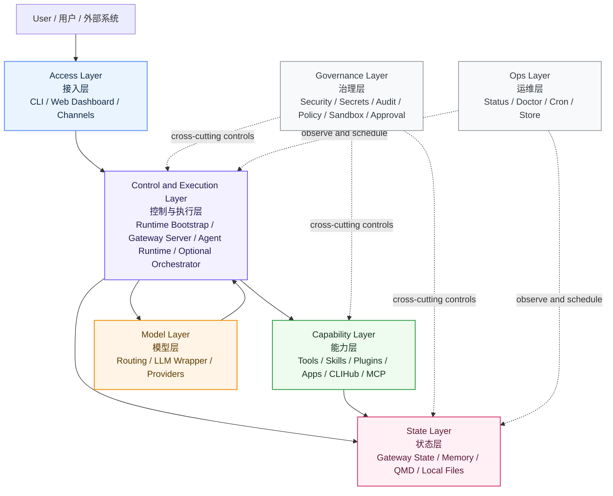

# AnyClaw 架构

## 概览

AnyClaw 是一个以本地优先为核心、使用 Go 编写的 AI Agent 工作空间，架构灵感来自 OpenClaw。它提供可运行在个人设备上的完整 AI 助手，支持 20 多个消息渠道、插件/扩展体系、技能系统，以及以文件为中心的记忆能力。

## 总体分层图



这张图强调 AnyClaw 的层次关系而不是包级细节：入口把请求送进控制与执行层，控制与执行层向下调用能力层、模型层和状态层，治理层与运维层则以横切方式作用于系统。

## 目录结构

```text
anyclaw/
|-- cmd/anyclaw/              # CLI 入口（多命令）
|   |-- main.go               # 主入口与命令分发
|   |-- agent_cli.go          # Agent 子命令
|   |-- channels_cli.go       # 渠道管理
|   |-- config_cli.go         # 配置管理
|   |-- gateway_cli.go        # Gateway 启动/停止/状态
|   |-- gateway_http.go       # Gateway HTTP 处理器
|   |-- plugin_cli.go         # 插件管理
|   |-- skill_cli.go          # 技能管理
|   |-- setup_cli.go          # 初始化/引导
|   `-- ...                   # 其他 CLI 命令
|-- pkg/                      # 核心包（Go 标准布局）
|   |-- agent/                # Agent 运行时（运行循环、工具调用）
|   |-- agents/               # Agent 定义
|   |-- agentstore/           # Agent 存储/安装
|   |-- apps/                 # 应用运行时、绑定与配对
|   |-- audit/                # 审计日志
|   |-- auto-reply/           # 自动回复流水线
|   |-- cdp/                  # Chrome DevTools Protocol
|   |-- channel/              # 渠道兼容层
|   |-- channels/             # 渠道适配器（核心）
|   |-- chat/                 # 聊天处理
|   |-- clawbridge/           # claw-code 参考接口
|   |-- cliadapter/           # CLI 适配器系统
|   |-- clihub/               # CLI 执行目录
|   |-- config/               # 配置系统
|   |-- context/              # 上下文引擎
|   |-- context-engine/       # 上下文引擎抽象
|   |-- cron/                 # Cron 调度器
|   |-- enterprise/           # 企业功能（SSO、向量）
|   |-- event/                # 事件总线
|   |-- extension/            # 扩展加载与管理
|   |-- gateway/              # HTTP/WebSocket 网关服务器
|   |-- hooks/                # Hook 系统（message/tool/agent）
|   |-- i18n/                 # 国际化
|   |-- llm/                  # LLM 兼容层
|   |-- media/                # 媒体处理
|   |-- memory/               # 文件优先的记忆 + 混合搜索
|   |-- nodes/                # 节点系统
|   |-- orchestrator/         # 多 Agent 编排器
|   |-- pi/                   # 个人智能
|   |-- plugin/               # 插件系统
|   |-- prompt/               # 系统 Prompt 构建器
|   |-- providers/            # LLM Provider 管理
|   |-- reply/                # 回复处理
|   |-- routing/              # LLM 路由逻辑
|   |-- runtime/              # 引导/运行时编排
|   |-- sdk/                  # SDK
|   |-- security/             # 安全工具
|   |-- session/              # 会话管理
|   |-- setup/                # 初始化/引导
|   |-- skills/               # 技能加载/执行
|   |-- speech/               # 语音处理
|   |-- task/                 # 任务管理
|   |-- tools/                # 工具注册表与内置工具
|   |-- ui/                   # 终端 UI 工具
|   |-- verification/         # 验证/集成测试
|   |-- workflow/             # 工作流图引擎
|   `-- workspace/            # 工作空间初始化/rituals
|-- extensions/               # 渠道扩展（OpenClaw 风格）
|   |-- telegram/             # Telegram 渠道扩展
|   |-- discord/              # Discord 渠道扩展
|   |-- slack/                # Slack 渠道扩展
|   |-- whatsapp/             # WhatsApp 渠道扩展
|   |-- signal/               # Signal 渠道扩展
|   |-- irc/                  # IRC 渠道扩展
|   |-- matrix/               # Matrix 渠道扩展
|   |-- wechat/               # WeChat 渠道扩展
|   |-- feishu/               # Feishu/Lark 渠道扩展
|   |-- line/                 # LINE 渠道扩展
|   |-- msteams/              # Microsoft Teams 扩展
|   `-- googlechat/           # Google Chat 扩展
|-- skills/                   # 内置技能
|   `-- web-search/           # 网页搜索技能
|-- plugins/                  # 插件目录（运行时加载）
|-- workflows/personal/       # 工作空间引导文件
|   |-- AGENTS.md             # Agent 定义
|   |-- SOUL.md               # 人格/灵魂设定
|   |-- IDENTITY.md           # 身份定义
|   |-- MEMORY.md             # 记忆配置
|   |-- TOOLS.md              # 工具定义
|   |-- USER.md               # 用户画像
|   |-- HEARTBEAT.md          # 心跳配置
|   `-- memory/               # 每日记忆文件
|-- ui/                       # Web 控制界面
|-- docs/                     # 文档
|-- scripts/                  # 构建/开发脚本
|-- anyclaw.json              # 运行时配置
|-- go.mod / go.sum           # Go 模块定义
|-- package.json              # Node.js UI 工作区
|-- Dockerfile                # 容器定义
`-- docker-compose.yml        # Docker Compose 编排
```

## 核心组件

### 1. CLI 层（`cmd/anyclaw/`）

这是一个包含 20 多个子命令的多命令 CLI：
- **交互模式**：`anyclaw -i`，用于对话式界面
- **网关模式**：`anyclaw gateway start`，用于守护进程运行
- **管理能力**：配置、技能、插件、渠道、模型、Agent、cron、任务
- **诊断能力**：`doctor`、`status`、`health`

### 2. Agent 运行时（`pkg/agent/`）

核心推理引擎包含：
- **运行循环**：用户输入 -> 意图预处理 -> 系统 Prompt -> LLM 对话 -> 工具执行 -> 最终响应
- **工具调用解析**：原生 LLM tool call + 基于正则的文本回退
- **基于证据的执行**：检查 -> 规划 -> 执行 -> 验证 -> 调整
- **工具调用上限**：每轮最多 10 次，防止无限循环

### 3. Gateway（`pkg/gateway/`）

提供 HTTP + WebSocket 服务器能力：
- **50 多个 WebSocket RPC 方法**：chat、agents、sessions、tasks、tools、plugins、config、channels
- **Challenge-handshake 认证**：访问方法前先完成 nonce 校验
- **权限模型**：带层级访问检查的 RBAC
- **状态持久化**：会话、任务、事件、审批保存到 `.anyclaw/gateway/state.json`

### 4. 渠道系统（`pkg/channels/` + `extensions/`）

面向多平台消息接入，采用 **扩展式架构**（OpenClaw 风格）：
- **核心渠道**：Telegram、Discord、Slack、WhatsApp、Signal、IRC（内置适配器）
- **扩展渠道**：Matrix、WeChat、Feishu、LINE、MS Teams、Google Chat（基于插件）
- **单个扩展组成**：`anyclaw.extension.json` 清单 + 独立 Go 适配器
- **通信方式**：外部进程插件通过 stdin/stdout JSON 协议通信
- **轮询模型**：大多数渠道使用可配置轮询间隔

### 5. 插件系统（`pkg/plugin/`）

基于清单驱动、进程隔离的插件体系：
- **插件类型**：`tool`、`channel`、`app`、`node`、`surface`、`ingress`
- **执行方式**：外部进程 + `ANYCLAW_PLUGIN_INPUT` 环境变量
- **信任机制**：基于可信签名者的 SHA-256 签名校验
- **权限模型**：`tool:exec`、`fs:read`、`fs:write`、`net:out`

### 6. 扩展系统（`pkg/extension/`）

采用 OpenClaw 风格的扩展架构：
- **发现机制**：扫描 `extensions/` 目录中的 `anyclaw.extension.json` 清单
- **清单字段**：`id`、`name`、`version`、`kind`、`channels`、`entrypoint`、`permissions`、`config schema`
- **注册表**：支持加载、启用/禁用，以及按类型列出
- **运行时**：通过 stdin/stdout JSON 协议执行外部进程

### 7. 技能系统（`pkg/skills/`）

可复用的能力包：
- **格式**：`skill.json`（元数据）+ `SKILL.md`（人类可读说明）
- **执行方式**：外部进程（Python、Node.js、shell、PowerShell）
- **工具注册**：每个技能都会在工具注册表中注册为 `skill_<name>`
- **系统 Prompt**：技能可向 Prompt 注入补充片段

### 8. 记忆系统（`pkg/memory/`）

以文件为中心的记忆系统，支持 **混合搜索**（OpenClaw 风格）：
- **FileMemory**：按类型组织的 JSON 文件，例如 `conversation`、`reflection`、`fact`
- **每日 Markdown**：对话会追加到 `YYYY-MM-DD.md` 文件
- **混合搜索**：关键词（TF-IDF）+ Provider 向量相似度 + 时间衰减
- **MMR 排序**：使用最大边际相关性（Maximal Marginal Relevance）提高结果多样性
- **时间衰减**：指数衰减，半衰期可配置（默认 7 天）

### 9. Hook 系统（`pkg/hooks/`）

事件驱动的拦截器体系（OpenClaw 风格）：
- **消息 Hook**：`message:inbound`、`message:outbound`、`message:sent`
- **工具 Hook**：`tool:call`、`tool:result`、`tool:error`
- **Agent Hook**：`agent:start`、`agent:stop`、`agent:think`、`agent:error`
- **会话 Hook**：`session:create`、`session:close`、`session:message`
- **生命周期 Hook**：`gateway:start`、`gateway:stop`、`compaction:before/after`
- **中间件**：支持可组合的中间件链与超时控制

### 10. 配置系统（`pkg/config/`）

完整的配置体系包括：
- **顶层配置区块**：LLM、Agent、Providers、Skills、Memory、Gateway、Daemon、Channels、Plugins、Sandbox、Security、Orchestrator 等
- **Provider 配置档案**：支持具备不同能力的多个 LLM Provider
- **Agent 配置档案**：支持带人格规范的命名配置
- **环境变量覆盖**：如 `ANYCLAW_LLM_PROVIDER`、`ANYCLAW_LLM_API_KEY`
- **配置校验**：提供带错误报告的配置校验能力

### 11. 工具系统（`pkg/tools/`）

Agent 的动作执行层包含 25 个以上文件：
- **注册表**：支持分类与访问级别的线程安全工具注册
- **内置工具**：`read_file`、`write_file`、`list_directory`、`search_files`、`run_command`、网页抓取、浏览器控制
- **浏览器工具**：通过 `chromedp` 接入 Chrome DevTools Protocol
- **桌面工具**：UI 自动化、OCR、图像匹配、窗口管理
- **策略引擎**：基于路径的访问控制与权限级别
- **沙箱**：支持本地与 Docker 后端的执行沙箱

### 12. 路由系统（`pkg/routing/`）

基于关键词匹配的 LLM 路由：
- **推理路由**：复杂/规划/代码类请求 -> 推理型 Provider
- **快速路由**：简单请求 -> 快速型 Provider
- **配置位置**：`anyclaw.json` 中的 `llm.routing`

## 初始化流程

```text
main()
`-- run()
    `-- switch command
        |-- interactive: runRootCommand()
        |   |-- ensureConfigOnboarded()
        |   |-- config.Load()
        |   |-- appRuntime.Bootstrap()
        |   |   |-- 阶段 1：配置
        |   |   |-- 阶段 2：存储
        |   |   |-- 阶段 3：安全
        |   |   |-- 阶段 4：技能
        |   |   |-- 阶段 5：工具
        |   |   |-- 阶段 6：插件
        |   |   |-- 阶段 7：LLM
        |   |   `-- 阶段 8：Agent
        |   |-- rebindBuiltins()
        |   `-- runInteractive()
        `-- gateway: gatewayCLI.Start()
            |-- appRuntime.Bootstrap()
            |-- 初始化 Gateway 服务器
            |-- 启动渠道适配器
            `-- 启动 WebSocket 与 HTTP 监听器
```

## 设计模式

| 模式 | 使用位置 |
|------|----------|
| 分阶段启动 | `runtime.Bootstrap()`，按顺序执行多个阶段 |
| 发布-订阅 | `event.EventBus`，用于解耦组件通信 |
| 注册表 | `tools.Registry`、`plugin.Registry`、`extension.Registry` |
| 插件架构 | 基于清单驱动、进程隔离的插件 |
| 扩展架构 | OpenClaw 风格的 `extensions/` 清单体系 |
| 策略模式 | 配置校验器/迁移器、LLM Provider |
| 文件优先存储 | 记忆以 JSON 文件 + 每日 Markdown 保存 |
| 基于证据的执行 | Agent 的检查 -> 执行 -> 验证闭环 |
| 层级资源模型 | 组织 -> 项目 -> 工作空间 |
| Hook 系统 | 消息/工具/Agent 生命周期拦截器 |
| 中间件链 | Hook 使用可组合中间件 |
| 混合搜索 | 关键词 + 向量 + 时间衰减 + MMR |

## 与 OpenClaw 的差异

| 维度 | AnyClaw（Go） | OpenClaw（TypeScript） |
|------|---------------|------------------------|
| 语言 | Go（编译型，单二进制） | TypeScript（Node.js 运行时） |
| 模块系统 | Go packages（`pkg/`） | pnpm workspaces（packages、extensions） |
| 插件加载 | 外部进程（stdin/stdout JSON） | jiti 运行时转译 |
| 分发方式 | 单个静态二进制 | npm 包 |
| 并发模型 | Goroutines + channels | Async/await + event emitters |
| 记忆实现 | 文件优先的 JSON + Markdown | SQLite + sqlite-vec + LanceDB |
| 构建方式 | `go build` | `tsdown` bundler + Vite |
| 渠道支持 | 内置 + 扩展进程 | 扩展包（44+） |
| UI | 内嵌仪表盘 + Lit SPA | 由 Gateway 提供的 Lit SPA |
| 原生应用 | 暂未提供 | Android、iOS、macOS 应用 |

## 支持的渠道

| 渠道 | 状态 | 类型 |
|------|------|------|
| Telegram | 内置 | 轮询 |
| Discord | 内置 | 轮询 + Webhook |
| Slack | 内置 | 轮询 |
| WhatsApp | 内置 | Webhook |
| Signal | 内置 | 轮询（signal-cli） |
| IRC | 内置 | 持久连接 |
| Matrix | 扩展 | 轮询 |
| WeChat | 扩展 | Webhook |
| Feishu/Lark | 扩展 | Webhook |
| LINE | 扩展 | Webhook |
| MS Teams | 扩展 | Webhook |
| Google Chat | 扩展 | Webhook |

## 快速开始

```bash
# 构建
go build -o anyclaw ./cmd/anyclaw

# 初始化设置
./anyclaw --setup

# 交互模式
./anyclaw -i

# 网关模式
./anyclaw gateway start
```

## 配置

运行时配置保存在 `anyclaw.json`：

```json
{
  "llm": {
    "provider": "openai",
    "model": "gpt-4",
    "api_key": "sk-..."
  },
  "channels": {
    "telegram": {
      "enabled": true,
      "bot_token": "...",
      "poll_every": 3
    }
  },
  "memory": {
    "backend": "file"
  },
  "gateway": {
    "port": 18789
  }
}
```

## 版本

`2026.3.13`
