# AnyClaw 架构设计文档（重构版）

> 目标：
>
> AnyClaw 的目标，是构建一个基于openclaw并实现二级路由持久子代理的，具有云端 skill 库、自动路由机制和静默安装能力的，本地优先、可控执行、可扩展协作的 AI Agent 系统。用户只需要面向一个主 Agent 提出任务，系统就在背后统一完成，并最终把结果回流给用户，让 AI 真正能够在真实工作区和真实渠道中完成任务，让用户更便捷。

## 1. 分层总览

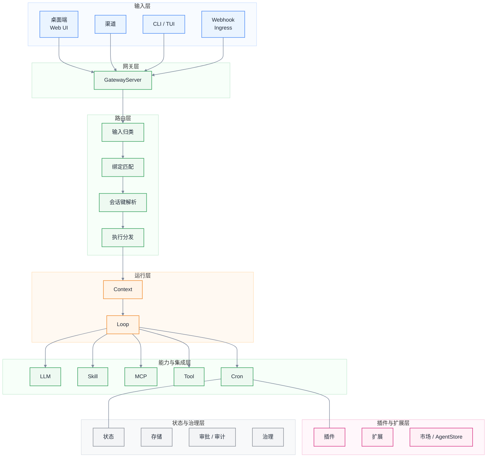

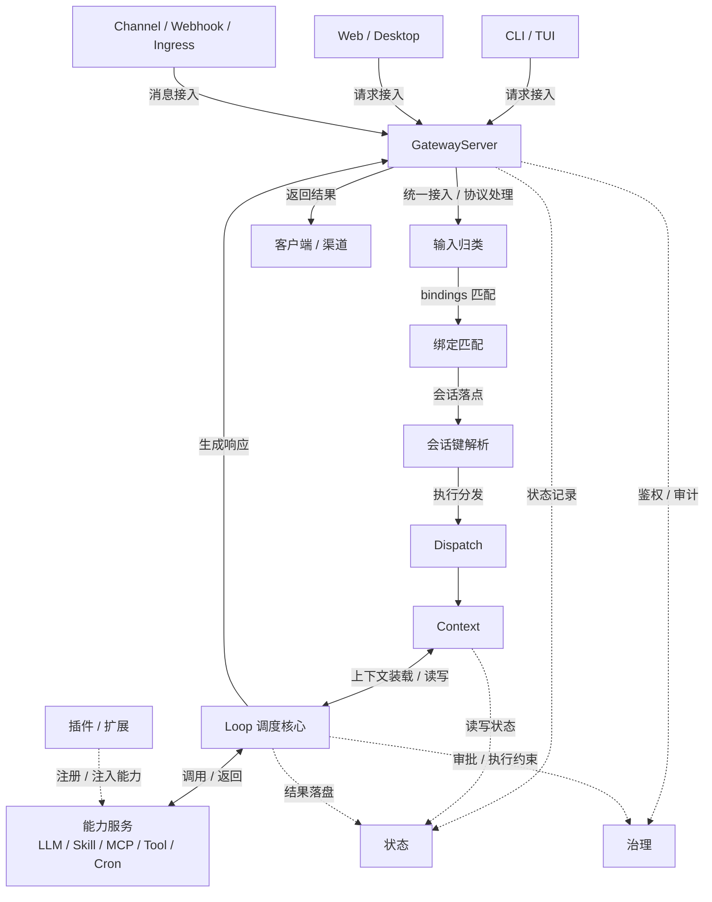

### 1.1 输入层

| 模块 | 模块说明 | 对应代码 |
|---|---|---|
| CLI / TUI 入口模块 | 负责本地命令解析、交互模式和子命令分发 | `cmd/anyclaw/` |
| 渠道接入模块 | 负责 Telegram、Slack、Discord、Signal 等渠道消息接入 | `pkg/channels/` `pkg/channel/` `extensions/` |
| Webhook / 外部请求标准化模块 | 负责把 HTTP、WS、Webhook、外部请求整理成统一输入对象 | `pkg/gateway/` `pkg/channels/` |

### 1.2 网关层

| 模块 | 模块说明 | 对应代码 |
|---|---|---|
| Gateway Server 模块 | 提供 HTTP、WebSocket、REST、控制面入口 | `pkg/gateway/gateway.go` `pkg/gateway/ws.go` |
| Session / Task 控制与任务规划模块 | 负责会话生命周期、任务状态、执行记录和低成本任务规划 | `pkg/gateway/state.go` `pkg/gateway/tasks.go` `pkg/routing/router.go` |
| RuntimePool 与接入治理模块 | 负责 runtime 复用、鉴权、限流和审批前置 | `pkg/gateway/runtimes.go` `pkg/gateway/auth.go` `pkg/gateway/approvals.go` |

### 1.3 路由层

| 模块 | 模块说明 | 对应代码 |
|---|---|---|
| Inbound Classifier / 输入归类模块 | 负责从入站事件提取 channel、account、peer、thread、guild、team 等可路由字段 | `pkg/gateway/gateway.go` `pkg/gateway/plugin_channel.go` `pkg/channels/` |
| Binding Matcher / 绑定匹配模块 | 负责按照 bindings 风格规则确定目标 agent 和默认回退 | `pkg/channels/routing.go` `pkg/gateway/gateway.go` |
| Session Key Resolver / 会话键解析模块 | 负责生成和解析 session key，并维持 agent + peer/thread 的会话一致性 | `pkg/channels/routing.go` `pkg/gateway/state.go` `pkg/gateway/gateway.go` |
| Dispatch Orchestrator / 分发模块 | 负责把已定好 agentId 和 sessionKey 的请求送入 runtime、controller 和 reply pipeline | `pkg/gateway/gateway.go` `pkg/gateway/runtimes.go` `pkg/agenthub/controller.go` `pkg/agent/agent.go` |

### 1.4 运行层

| 模块 | 模块说明 | 对应代码 |
|---|---|---|
| Runtime Bootstrap 模块 | 负责装配 Config、Secrets、Storage、Skills、Tools、Plugins、LLM、Agent | `pkg/runtime/runtime.go` |
| Context 装载模块 | 负责组装工作区、历史、记忆和上下文预算 | `pkg/agent/context_runtime.go` `pkg/context/` `pkg/context-engine/` `pkg/workspace/` |
| Main Agent Loop 模块 | 负责 Prompt 构建、模型调用、工具循环和结果回写 | `pkg/agent/agent.go` `pkg/prompt/` |
| Multi-Agent 编排模块 | 负责多代理分解、调度、消息总线和子任务汇总 | `pkg/orchestrator/` `pkg/agenthub/` |

### 1.5 能力与集成层

| 模块 | 模块说明 | 对应代码 |
|---|---|---|
| LLM / Provider / Model Selection 模块 | 负责统一封装模型提供方，并承载 provider/model 选型策略 | `pkg/llm/` `pkg/providers/` `pkg/routing/routing.go` |
| Tool Registry 与内置工具模块 | 负责内置工具注册、调用、缓存和权限控制 | `pkg/tools/registry.go` `pkg/tools/` |
| Skill 装载与提示增强模块 | 负责 skill 装载、筛选、提示增强和工具化暴露 | `pkg/skills/` |
| MCP 集成模块 | 负责 OpenClaw 与外部 MCP server / client 的桥接和统一管理 | `pkg/mcp/` |
| Cron 调度模块 | 负责持久化作业、定时唤醒和自动化执行调度 | `pkg/cron/` |

### 1.6 状态与治理层

| 模块 | 模块说明 | 对应代码 |
|---|---|---|
| Config / Workspace 模块 | 负责配置加载、路径归一化和工作区引导文件 | `pkg/config/` `pkg/workspace/` |
| Memory / Session / QMD 模块 | 负责记忆、会话状态和结构化状态存储 | `pkg/memory/` `pkg/sessionstore/` `pkg/qmd/` `pkg/gateway/state.go` |
| Security / Secrets / Audit 模块 | 负责密钥管理、审计日志和安全状态 | `pkg/security/` `pkg/secrets/` `pkg/audit/` |
| Policy / Sandbox / Approval 模块 | 负责执行策略、沙箱约束和审批前置 | `pkg/tools/policy.go` `pkg/tools/sandbox.go` `pkg/gateway/approvals.go` |

### 1.7 插件与扩展层

| 模块 | 模块说明 | 对应代码 |
|---|---|---|
| Plugin Registry 模块 | 负责插件清单解析、签名校验和能力注册 | `pkg/plugin/` |
| Channel Extension 模块 | 负责渠道扩展发现、适配器运行和协议桥接 | `pkg/extension/` `extensions/` |
| Market / AgentStore 模块 | 负责插件、Agent、市场和本地安装分发 | `pkg/market/` `pkg/agentstore/` |

## 2. 输入层模块设计

### 2.1 CLI / TUI 入口模块

**对应代码**

- `cmd/anyclaw/main.go`
- `cmd/anyclaw/*_cli.go`
- `pkg/consoleio/`

**为什么要有这个模块**

- AnyClaw 需要一个最低成本、最稳定的本地入口，便于调试、开发、运维和直接执行。
- 如果没有独立 CLI 层，命令解析、模式切换和运行时启动逻辑会散落到 Gateway 和 Agent 中。

**模块作用**

- 解析 root command 和子命令。
- 决定进入交互模式、任务模式、gateway 模式还是运维模式。
- 调用 `runtime.Bootstrap` 或连接 Gateway 客户端。

**模块边界**

- 负责“请求从终端怎么进入系统”。
- 不负责 HTTP 服务、不负责任务规划、不负责工具执行。

**架构图**

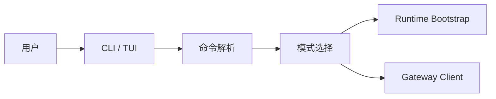

**流程图**

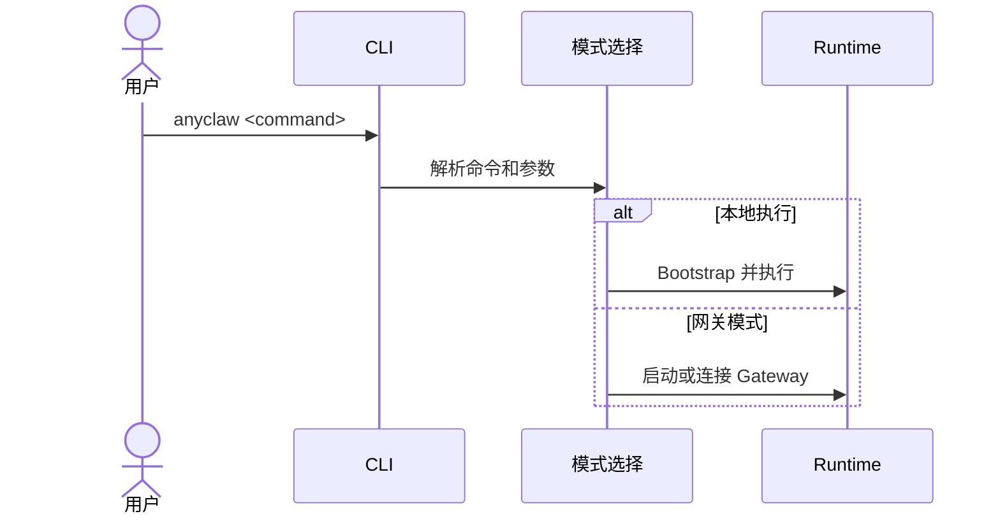

### 2.2 渠道接入模块

**对应代码**

- `pkg/channels/`
- `pkg/channel/`
- `extensions/`

**为什么要有这个模块**

- AnyClaw 的输入不是单一前端，而是多个 IM 渠道和扩展渠道。
- 如果没有独立渠道层，每个渠道都会自己维护一套会话和代理逻辑，系统会快速失控。

**模块作用**

- 接入 Telegram、Slack、Discord、WhatsApp、Signal 等渠道。
- 统一渠道适配器接口和回调方式。
- 把外部消息转换成系统内部可处理的请求。

**模块边界**

- 负责“外部消息怎么接进来”。
- 不直接决定任务如何执行，不直接实现模型推理。

**架构图**

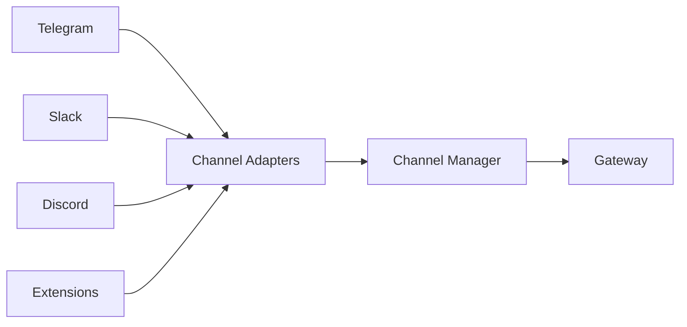

**流程图**

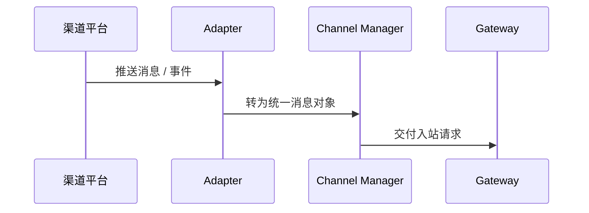

### 2.3 Webhook / 外部请求标准化模块

**对应代码**

- `pkg/gateway/gateway.go`
- `pkg/gateway/ws.go`
- `pkg/gateway/plugin_channel.go`

**为什么要有这个模块**

- CLI、Web、Webhook、渠道消息的原始数据结构不同，必须在进入路由层前收敛成统一格式。
- 标准化之后，下游只处理“请求”，不再处理“入口差异”。

**模块作用**

- 把 REST、WebSocket、Webhook 和渠道事件收敛成统一请求对象。
- 补全用户、线程、source、workspace、session 相关元数据。

**模块边界**

- 负责“统一输入模型”。
- 不负责 session 归属判断和任务路径选择。

**架构图**

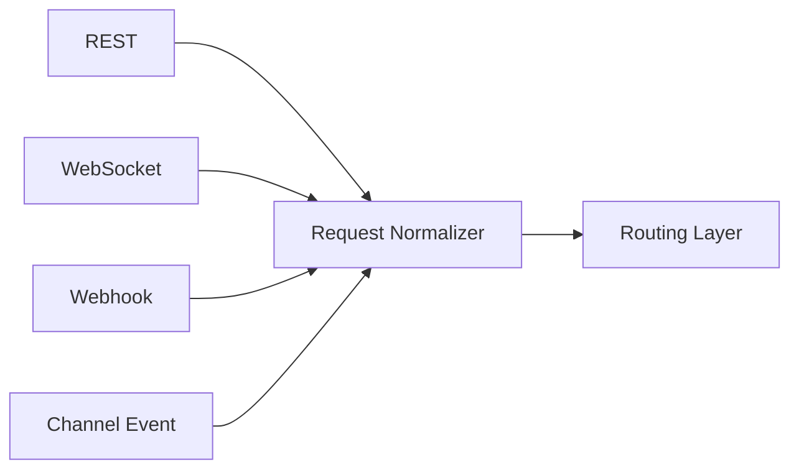

**流程图**

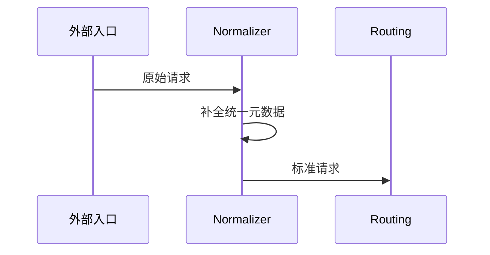

## 3. 网关层模块设计

### 3.1 Gateway Server 模块

**对应代码**

- `pkg/gateway/gateway.go`
- `pkg/gateway/ws.go`
- `cmd/anyclaw/gateway_cli.go`

**为什么要有这个模块**

- AnyClaw 需要一个统一控制面来承接多入口请求。
- 如果没有 Gateway，session、task、runtime、event 会在 CLI 和渠道之间分裂。

**模块作用**

- 提供 HTTP / WS / REST / 控制面接口。
- 维护网关状态、公开控制 API、转发请求到运行层。

**模块边界**

- 负责“请求进入系统后的统一接入与分发”。
- 不直接承担 Main Agent 推理循环。

**架构图**

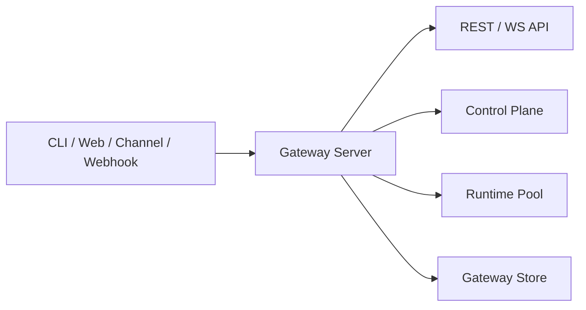

**流程图**

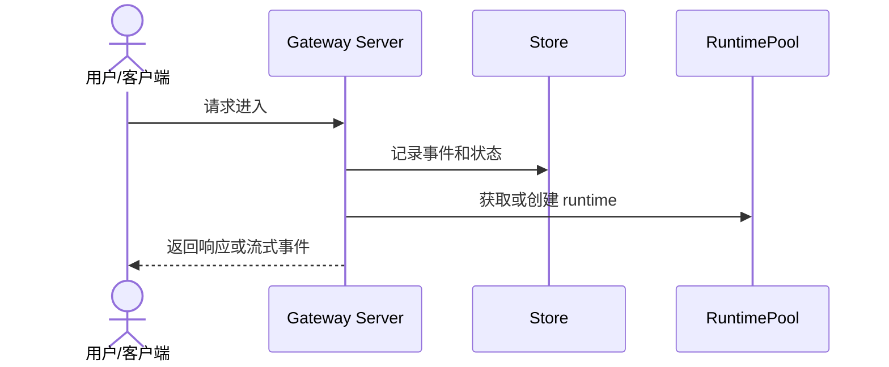

### 3.2 Session / Task 控制与任务规划模块

**对应代码**

- `pkg/gateway/state.go`
- `pkg/gateway/tasks.go`
- `pkg/routing/router.go`

**为什么要有这个模块**

- 会话连续性和任务推进不是同一类状态，必须拆开管理。
- 没有独立 Session / Task 控制模块，系统只能做单轮对话，无法做真实任务跟踪。

**模块作用**

- 管理 `Session`、`Task`、`TaskStep`、`Evidence`、`Artifact`。
- 记录任务计划、执行结果、恢复点和审批等待状态。
- 通过低成本规划逻辑为任务生成 `plan summary` 和步骤草案。

**模块边界**

- 负责“状态控制面 + 任务规划入口”。
- 不负责主代理推理循环和具体工具执行细节。

**架构图**

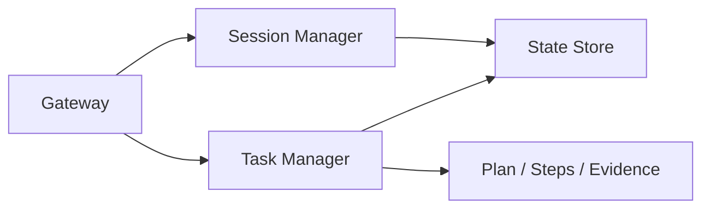

**流程图**

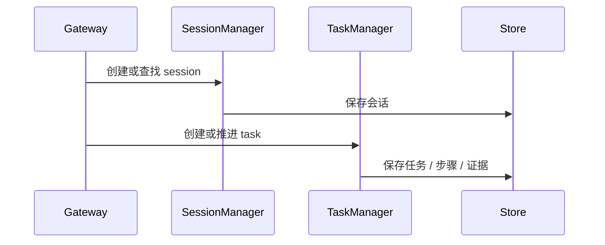

### 3.3 RuntimePool 与接入治理模块

**对应代码**

- `pkg/gateway/runtimes.go`
- `pkg/gateway/auth.go`
- `pkg/gateway/approvals.go`

**为什么要有这个模块**

- Runtime 初始化成本高，不能每个请求都重建。
- 接入治理必须早于执行治理，否则风险请求会直接进入主链路。

**模块作用**

- 按 agent、workspace、org、project 复用 runtime。
- 在请求执行前完成鉴权、限流和审批判断。

**模块边界**

- 负责“接入时治理与 runtime 复用”。
- 不负责任务具体执行。

**架构图**

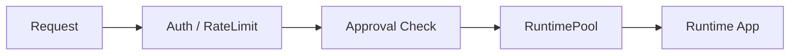

**流程图**

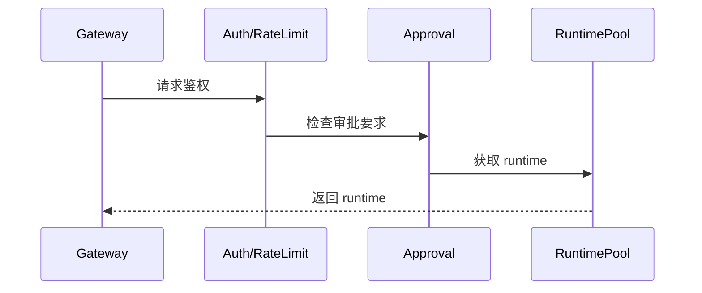

## 4. 路由层模块设计
本节按 OpenClaw 风格重构路由层定义。路由层不再把“任务规划”和“模型选路”当作主链路核心，而是回到 OpenClaw 的四步主链：

1. 先把入站消息转成可路由对象。
2. 再按 bindings 规则确定目标 agent。
3. 然后解析 session key，保证会话落点稳定。
4. 最后把结果分发到 runtime、agent runner 和 reply pipeline。

因此，当前仓库中的 `pkg/routing/router.go` 更适合视为任务规划优化，而不是核心路由层本体；核心路由层应聚焦“消息如何进入哪个 agent、哪个 session，并送入哪条执行链”。

### 4.1 Inbound Classifier / 输入归类模块

**对应代码**

- `pkg/gateway/gateway.go`
- `pkg/gateway/plugin_channel.go`
- `pkg/channels/`

**为什么要有这个模块**

- 原始入站事件来自 CLI、渠道、Webhook、WS，它们的字段结构并不统一。
- OpenClaw 风格路由的第一步不是立即选 Agent，而是先把消息整理成“可路由对象”。

**模块作用**

- 从入站事件中提取 `channel`、`accountId`、`peer`、`parentPeer`、`guildId`、`teamId`、`direct/group` 等关键字段。
- 把原始消息转换成后续路由层能够一致处理的输入对象。

**模块边界**

- 负责“提取路由判定所需元数据”。
- 不负责 bindings 匹配，不负责 session key 生成，不负责执行分发。

**架构图**

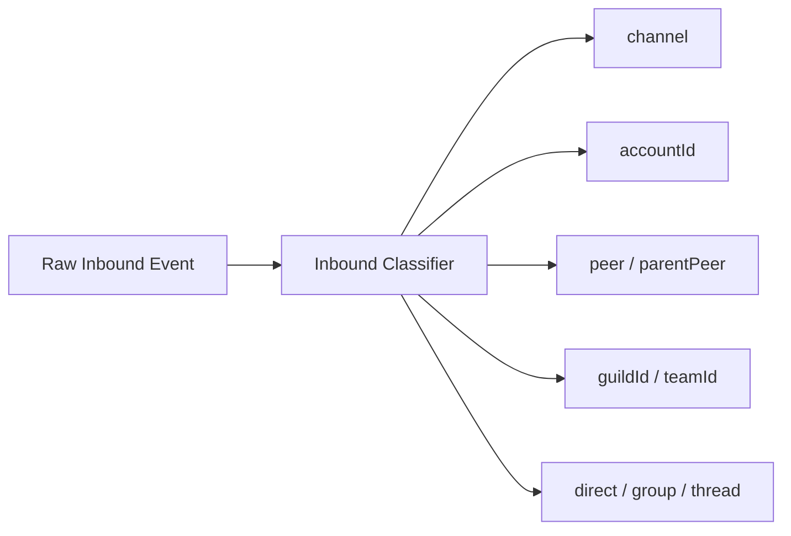

**流程图**

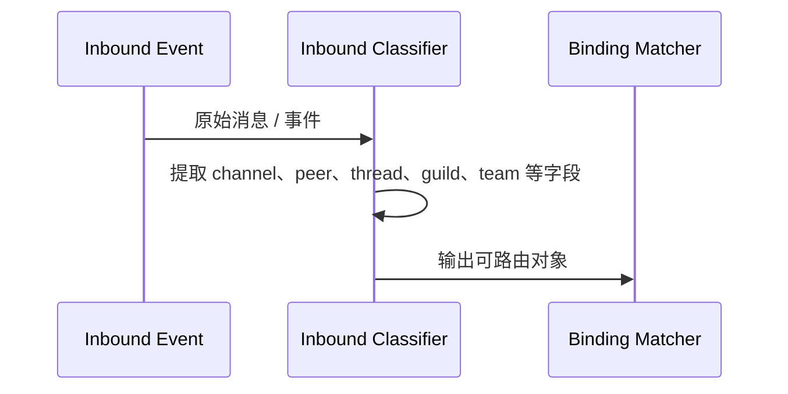

### 4.2 Binding Matcher / 绑定匹配模块

**对应代码**

- `pkg/channels/routing.go`
- `pkg/gateway/gateway.go`

**为什么要有这个模块**

- OpenClaw 的核心路由不是“把消息丢给大模型决定”，而是“按 bindings 规则确定性选 Agent”。
- 如果没有 bindings matcher，Agent 选择会退化成隐式逻辑或硬编码，后续很难治理。

**模块作用**

- 读取绑定规则。
- 按“最具体优先”执行匹配。
- 产出目标 `agentId`，并处理默认回退。

**模块边界**

- 负责“选哪个 Agent”。
- 不负责 session key 解析，不负责消息最终发送。

**架构图**

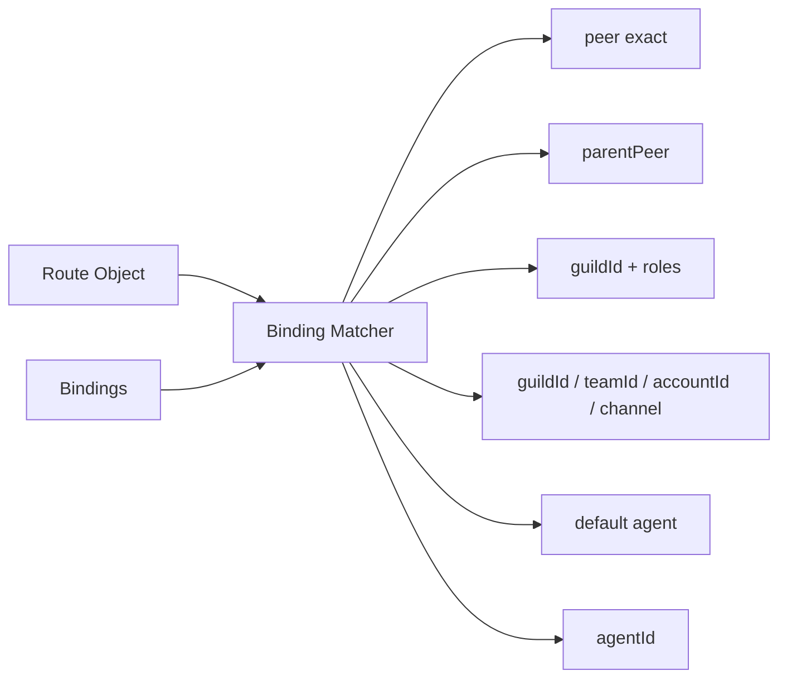

**流程图**

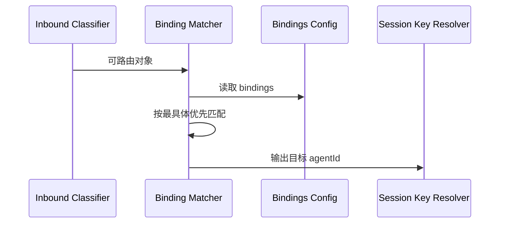

### 4.3 Session Key Resolver / 会话键解析模块

**对应代码**

- `pkg/channels/routing.go`
- `pkg/gateway/state.go`
- `pkg/gateway/gateway.go`

**为什么要有这个模块**

- OpenClaw 路由层不仅决定“发给哪个 agent”，还决定“落到哪个 session”。
- 如果没有稳定的 session key，同一个 peer、线程、群组的上下文就无法持续复用。

**模块作用**

- 生成或解析 `sessionKey`。
- 区分 DM、群聊、线程和父线程场景。
- 保证 `agentId + peer/thread` 维度上的会话一致性，并决定是否复用已有 session。

**模块边界**

- 负责“会话落点解析”。
- 不负责 Agent 选择和最终执行分发。

**架构图**

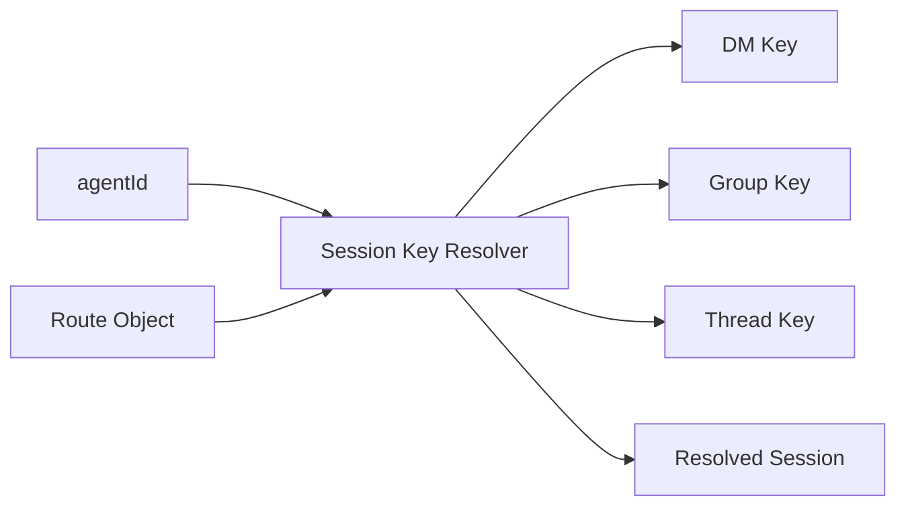

**流程图**

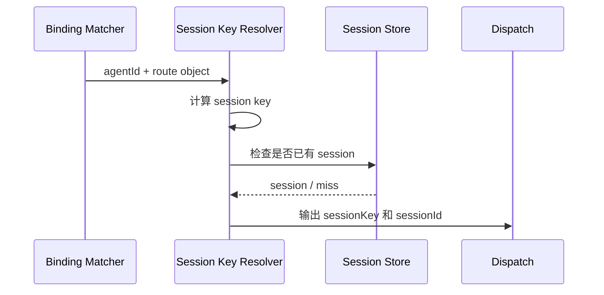

### 4.4 Dispatch Orchestrator / 分发模块

**对应代码**

- `pkg/gateway/gateway.go`
- `pkg/gateway/runtimes.go`
- `pkg/agenthub/controller.go`
- `pkg/agent/agent.go`

**为什么要有这个模块**

- 路由层前面三步只算出了结果，系统还需要把结果真正送入执行链。
- 如果没有显式分发模块，`agentId` 和 `sessionKey` 只是中间结果，无法形成完整运行闭环。

**模块作用**

- 组装 dispatch payload。
- 带上 `agentId`、`sessionKey`、`sessionId` 和请求体。
- 调用 runtime、controller、agent runner 或 reply pipeline，推动后续执行和结果回流。

**模块边界**

- 负责“把路由结果送入执行链”。
- 不负责 bindings 匹配和 session key 计算。

**架构图**

```mermaid
flowchart LR
    ROUTED[agentId + sessionKey + payload] --> DIS[Dispatch Orchestrator]
    DIS --> POOL[RuntimePool]
    DIS --> CTRL[MainController]
    DIS --> RUNNER[Agent Runner]
    RUNNER --> REPLY[Reply / Stream Pipeline]
```

**流程图**

```mermaid
sequenceDiagram
    participant SKR as Session Key Resolver
    participant DIS as Dispatch Orchestrator
    participant POOL as RuntimePool
    participant CTRL as MainController / Agent
    participant OUT as Reply Pipeline
    SKR->>DIS: agentId + sessionKey + payload
    DIS->>POOL: 获取目标 runtime
    DIS->>CTRL: 投递 run request
    CTRL->>OUT: 产生回复 / 流式事件
    OUT-->>DIS: 执行结果
```

## 5. 运行层模块设计

### 5.1 Runtime Bootstrap 模块

**对应代码**

- `pkg/runtime/runtime.go`

**为什么要有这个模块**

- Config、Secrets、Storage、Skills、Tools、Plugins、LLM、Agent 之间存在明确初始化顺序。
- 如果每个入口自己拼 runtime，会出现多套不一致运行时。

**模块作用**

- 按阶段装配完整 `runtime.App`。
- 统一管理配置路径、工作区路径、内存、工具、插件和主代理实例。

**模块边界**

- 负责“系统怎么起机”。
- 不直接参与单次用户请求的业务决策。

**架构图**

```mermaid
flowchart LR
    CFG[Config]
    SEC[Secrets]
    STO[Storage]
    SK[Skills]
    TL[Tools]
    PL[Plugins]
    LLM[LLM]
    AG[Agent]
    CFG --> BOOT[Runtime Bootstrap]
    SEC --> BOOT
    STO --> BOOT
    SK --> BOOT
    TL --> BOOT
    PL --> BOOT
    LLM --> BOOT
    BOOT --> APP[Runtime App]
    APP --> AG
```

**流程图**

```mermaid
sequenceDiagram
    participant CLI as Entry
    participant BOOT as Bootstrap
    participant APP as Runtime App
    CLI->>BOOT: Bootstrap(options)
    BOOT->>BOOT: Config -> Secrets -> Storage
    BOOT->>BOOT: Skills -> Tools -> Plugins
    BOOT->>BOOT: LLM -> Agent -> Orchestrator
    BOOT-->>APP: 返回 App
```

### 5.2 Context 装载模块

**对应代码**

- `pkg/agent/context_runtime.go`
- `pkg/context/`
- `pkg/context-engine/`
- `pkg/workspace/`

**为什么要有这个模块**

- Agent 不是只看当前一句话，还要看工作区、历史、记忆和上下文预算。
- 如果没有 Context 层，Prompt 会被输入噪声和历史膨胀拖垮。

**模块作用**

- 加载工作区引导文件、历史记录和相关记忆。
- 控制上下文压缩、预算和执行期间的上下文占用。

**模块边界**

- 负责“给主代理准备上下文”。
- 不负责会话归属和最终工具执行。

**架构图**

```mermaid
flowchart LR
    WS[Workspace Files]
    HIS[History]
    MEM[Memory]
    BUD[Context Budget]
    WS --> CTX[Context Loader]
    HIS --> CTX
    MEM --> CTX
    BUD --> CTX
    CTX --> PROMPT[Prompt Builder]
```

**流程图**

```mermaid
sequenceDiagram
    participant GW as Gateway
    participant CTX as Context Loader
    participant MEM as Memory
    participant WS as Workspace
    participant AG as Agent
    GW->>CTX: 请求上下文装载
    CTX->>MEM: 检索相关记忆
    CTX->>WS: 读取工作区引导文件
    CTX->>AG: 返回可用上下文
```

### 5.3 Main Agent Loop 模块

**对应代码**

- `pkg/agent/agent.go`
- `pkg/prompt/`

**为什么要有这个模块**

- AnyClaw 的核心不是单个工具，而是 Main Agent 统一接单、统一推理、统一回流结果。
- 没有 Main Agent Loop，技能、工具、插件和模型都无法形成完整闭环。

**模块作用**

- 构建系统 Prompt。
- 发起模型调用。
- 处理 tool call 循环、记录历史、回写记忆。

**模块边界**

- 负责“单 Agent 执行闭环”。
- 不负责网关接入治理，不负责插件发现。

**架构图**

```mermaid
flowchart LR
    INPUT[User Input] --> LOOP[Main Agent Loop]
    LOOP --> PROMPT[Prompt Builder]
    LOOP --> MODEL[LLM]
    LOOP --> TOOLS[Tool Registry]
    LOOP --> MEMORY[Memory]
    MODEL --> LOOP
    TOOLS --> LOOP
```

**流程图**

```mermaid
sequenceDiagram
    participant AG as Agent
    participant MD as Model
    participant TL as Tools
    participant MEM as Memory
    AG->>MD: Prompt + Tools
    MD-->>AG: 回复 / tool calls
    alt 需要工具
        AG->>TL: 调用工具
        TL-->>AG: 返回结果
        AG->>MD: 带工具结果继续推理
    end
    AG->>MEM: 记录历史和记忆
```

### 5.4 Multi-Agent 编排模块

**对应代码**

- `pkg/orchestrator/`
- `pkg/agenthub/`

**为什么要有这个模块**

- 单 Agent 适合直接执行，复杂任务则需要拆解、分工和汇总。
- 多代理编排独立出来后，主链路仍能保持 Main Agent 统一入口。

**模块作用**

- 对任务做 decomposition。
- 选择可用子代理。
- 通过消息总线和任务队列并发执行并汇总结果。

**模块边界**

- 负责“复杂任务分工协作”。
- 不替代 Main Agent 作为默认入口。

**架构图**

```mermaid
flowchart LR
    MAIN[Main Agent / Controller] --> ORCH[Orchestrator]
    ORCH --> DECOMP[Task Decomposer]
    ORCH --> POOL[SubAgent Pool]
    ORCH --> BUS[Message Bus]
    ORCH --> QUEUE[Task Queue]
```

**流程图**

```mermaid
sequenceDiagram
    participant MAIN as Main Agent
    participant ORCH as Orchestrator
    participant SUB as SubAgents
    participant BUS as MessageBus
    MAIN->>ORCH: 提交复杂任务
    ORCH->>ORCH: 任务分解
    ORCH->>SUB: 分派子任务
    SUB->>BUS: 回传中间结果
    BUS->>ORCH: 汇总结果
    ORCH-->>MAIN: 返回最终摘要
```

## 6. 能力与集成层模块设计

### 6.1 LLM / Provider / Model Selection 模块

**对应代码**

- `pkg/llm/`
- `pkg/providers/`
- `pkg/routing/routing.go`

**为什么要有这个模块**

- 不同 provider 的 API 和响应格式不同，不能把差异暴露给上层。
- OpenClaw 风格系统不仅要调用模型，还要统一管理 provider 定义、认证状态、标准化和失败回退策略。

**模块作用**

- 屏蔽不同模型提供方差异。
- 提供 `Chat`、`StreamChat`、多模态和 failover 能力。
- 承载 provider/model 目录、选择和失败切换策略。

**模块边界**

- 负责“模型调用适配”。
- 不负责 session、task 和插件治理。

**架构图**

```mermaid
flowchart LR
    ROUTE[Model Routing] --> WRAP[LLM Wrapper]
    WRAP --> P1[Provider A]
    WRAP --> P2[Provider B]
    WRAP --> P3[Provider C]
```

**流程图**

```mermaid
sequenceDiagram
    participant AG as Agent
    participant LLM as Wrapper
    participant PROV as Provider
    AG->>LLM: Chat / StreamChat
    LLM->>PROV: 转换 provider 请求
    PROV-->>LLM: 模型响应
    LLM-->>AG: 统一响应对象
```

### 6.2 Tool Registry 与内置工具模块

**对应代码**

- `pkg/tools/registry.go`
- `pkg/tools/`

**为什么要有这个模块**

- 工具数量多、来源多、权限不同，必须有统一注册表。
- 否则 Agent 无法以统一方式发现、调用和治理工具。

**模块作用**

- 统一注册工具定义和处理函数。
- 管理分类、缓存、重试、审计和超时。

**模块边界**

- 负责“工具侧统一执行接口”。
- 不负责决定何时调用哪个工具。

**架构图**

```mermaid
flowchart LR
    BUILTIN[Built-in Tools]
    SKILLTOOL[Skill Tools]
    PLGTOOL[Plugin Tools]
    BUILTIN --> REG[Tool Registry]
    SKILLTOOL --> REG
    PLGTOOL --> REG
    REG --> AG[Agent]
```

**流程图**

```mermaid
sequenceDiagram
    participant AG as Agent
    participant REG as Registry
    participant TL as Tool
    AG->>REG: 按名称调用工具
    REG->>TL: 执行 handler
    TL-->>REG: 返回结果
    REG-->>AG: 返回统一输出
```

### 6.3 Skill 装载与提示增强模块

**对应代码**

- `pkg/skills/`

**为什么要有这个模块**

- Skill 的本质更接近 `SKILL.md` 一类“教 agent 在什么场景下、如何使用能力”的指导资源，而不是单纯执行单元。
- 如果技能不做统一管理，Main Agent 就无法稳定获得提示增强和能力选择指导。

**模块作用**

- 加载 builtin 和本地 skills。
- 根据配置过滤启用的 skills。
- 将 skill 作为 Prompt 增强资源注入系统。
- 在需要时把 skill 暴露为 `skill_*` 工具入口。

**模块边界**

- 负责“技能装载、提示增强与能力暴露”。
- 不直接承担插件签名校验、session 管理和底层工具执行。

**架构图**

```mermaid
flowchart LR
    BUILTIN[Built-in Skills]
    LOCAL[Local Skills]
    BUILTIN --> SM[SkillsManager]
    LOCAL --> SM
    SM --> PROMPT[Prompt Injection]
    SM --> TOOL[Skill Tools]
```

**流程图**

```mermaid
sequenceDiagram
    participant RT as Runtime
    participant SM as SkillsManager
    participant REG as Tool Registry
    RT->>SM: Load()
    SM->>SM: 读取 builtin 和本地 skills
    SM->>REG: 注册 skill_* 工具
```

### 6.4 MCP 集成模块

**对应代码**

- `pkg/mcp/`

**为什么要有这个模块**

- MCP 在 OpenClaw 风格架构里更像协议桥和集成桥，而不是单纯的 agent 内生能力。
- 系统既可能对外暴露 OpenClaw 能力给 MCP 客户端，也可能对内接入外部 MCP server 的能力，因此需要独立模块承载。

**模块作用**

- 统一管理 MCP server/client 定义。
- 暴露和接入 MCP tools、resources、prompts。
- 连接 OpenClaw runtime 与外部 MCP 生态。

**模块边界**

- 负责“MCP 协议桥接与集成”。
- 不负责主代理推理、session 路由和 Cron 调度。

**架构图**

```mermaid
flowchart LR
    EXTCLI[External MCP Client] --> MCPSRV[OpenClaw MCP Server]
    AG[Runtime / Agent] --> MCPCLI[MCP Client Manager]
    MCPCLI --> EXTMS[External MCP Servers]
    MCPSRV --> GW[Gateway / Runtime]
```

**流程图**

```mermaid
sequenceDiagram
    participant AG as Runtime / Agent
    participant MCP as MCP Manager
    participant OUT as External MCP Server
    AG->>MCP: 请求 MCP 资源 / 工具
    MCP->>OUT: 调用外部 MCP server
    OUT-->>MCP: 返回资源 / 工具结果
    MCP-->>AG: 统一返回
```

### 6.5 Cron 调度模块

**对应代码**

- `pkg/cron/`

**为什么要有这个模块**

- Cron 更接近 Gateway 内建调度服务，而不是普通 agent 工具。
- 它负责的是持久化作业、定时唤醒和结果投递，不应该与 MCP 或 Skill 混写成同一种能力单元。

**模块作用**

- 管理持久化作业与调度规则。
- 按时间唤醒 runtime 或 agent 执行任务。
- 将结果投递回聊天渠道、session 或 webhook。

**模块边界**

- 负责“时间驱动的自动化调度”。
- 不负责 bindings 路由、不负责 MCP 集成、不负责主代理 prompt 构建。

**架构图**

```mermaid
flowchart LR
    JOB[Persisted Jobs] --> CRON[Scheduler]
    CRON --> RT[Runtime / Agent]
    RT --> OUT[Channel / Webhook / Session]
```

**流程图**

```mermaid
sequenceDiagram
    participant STORE as Job Store
    participant CRON as Scheduler
    participant RT as Runtime / Agent
    participant OUT as Channel / Webhook
    STORE->>CRON: 加载定时作业
    CRON->>RT: 到点触发任务
    RT-->>CRON: 返回执行结果
    CRON->>OUT: 投递结果
```

## 7. 状态与治理层模块设计

### 7.1 Config / Workspace 模块

**对应代码**

- `pkg/config/`
- `pkg/workspace/`
- `workflows/`

**为什么要有这个模块**

- AnyClaw 是本地优先系统，工作区和配置是所有运行时能力的根。
- 如果没有工作区引导和统一配置，Agent 不能稳定理解当前环境。

**模块作用**

- 管理 `Config`、路径解析、默认值和 profile。
- 生成 `AGENTS.md`、`TOOLS.md`、`SOUL.md`、`MEMORY.md` 等工作区引导文件。

**模块边界**

- 负责“静态运行上下文准备”。
- 不负责实时任务执行和网关接入。

**架构图**

```mermaid
flowchart LR
    JSON[anyclaw.json]
    ENV[Environment]
    WF[workflows/*]
    JSON --> CFG[Config Manager]
    ENV --> CFG
    CFG --> WS[Workspace Bootstrap]
    WF --> WS
```

**流程图**

```mermaid
sequenceDiagram
    participant BOOT as Bootstrap
    participant CFG as Config
    participant WS as Workspace
    BOOT->>CFG: Load + Validate
    CFG->>WS: 解析 working_dir 并生成引导文件
    WS-->>BOOT: 返回工作区上下文
```

### 7.2 Memory / Session / QMD 模块

**对应代码**

- `pkg/memory/`
- `pkg/sessionstore/`
- `pkg/qmd/`
- `pkg/gateway/state.go`

**为什么要有这个模块**

- 没有状态层，系统只能做瞬时问答，无法形成长期上下文和任务恢复能力。
- 会话状态、长期记忆和结构化数据属于不同存储维度，必须分层管理。

**模块作用**

- 提供记忆检索、会话历史、结构化状态、任务状态和事件存储。
- 支撑恢复点、工件、证据链和 daily memory。

**模块边界**

- 负责“存什么、怎么读写”。
- 不负责决定何时写入、何时检索。

**架构图**

```mermaid
flowchart LR
    AG[Agent]
    GW[Gateway]
    AG --> MEM[Memory]
    AG --> QMD[QMD]
    GW --> SESS[Session State]
    GW --> TASK[Task State]
```

**流程图**

```mermaid
sequenceDiagram
    participant AG as Agent/Gateway
    participant MEM as Memory
    participant QMD as QMD
    participant STATE as Session/Task State
    AG->>MEM: 检索或写入记忆
    AG->>QMD: 读写结构化数据
    AG->>STATE: 保存会话/任务状态
```

### 7.3 Security / Secrets / Audit 模块

**对应代码**

- `pkg/security/`
- `pkg/secrets/`
- `pkg/audit/`

**为什么要有这个模块**

- AnyClaw 会执行本地命令、访问外部服务、调用模型，安全和审计不能后补。
- 密钥、审计和安全状态必须有独立能力，否则系统不可控。

**模块作用**

- 管理密钥存储和运行时激活。
- 记录工具执行和系统行为审计。
- 提供安全状态和安全配置支撑。

**模块边界**

- 负责“安全元能力和追踪”。
- 不直接做工具执行，也不直接做 session 路由。

**架构图**

```mermaid
flowchart LR
    BOOT[Runtime]
    TL[Tools]
    AG[Agent]
    BOOT --> SEC[Secrets]
    TL --> AUDIT[Audit]
    AG --> AUDIT
    SEC --> AG
```

**流程图**

```mermaid
sequenceDiagram
    participant RT as Runtime
    participant SEC as Secrets
    participant AG as Agent/Tools
    participant AUD as Audit
    RT->>SEC: 激活运行时密钥
    AG->>AUD: 记录执行行为
```

### 7.4 Policy / Sandbox / Approval 模块

**对应代码**

- `pkg/tools/policy.go`
- `pkg/tools/sandbox.go`
- `pkg/gateway/approvals.go`

**为什么要有这个模块**

- AnyClaw 要做的不是只“能执行”，而是“能安全地执行”。
- 工具策略、沙箱和审批分别解决权限边界、执行环境和人工确认问题。

**模块作用**

- 限制读写路径、危险命令和网络出口。
- 提供沙箱执行能力。
- 在高风险动作前插入审批环节。

**模块边界**

- 负责“执行约束”。
- 不负责业务状态存储和任务规划。

**架构图**

```mermaid
flowchart LR
    AG[Agent] --> POL[Policy Engine]
    POL --> SB[Sandbox]
    POL --> AP[Approval]
    SB --> TL[Tool Execution]
```

**流程图**

```mermaid
sequenceDiagram
    participant AG as Agent
    participant POL as Policy
    participant AP as Approval
    participant SB as Sandbox
    participant TL as Tool
    AG->>POL: 请求执行工具
    POL->>AP: 判断是否需要审批
    AP-->>POL: allow / wait / deny
    POL->>SB: 在受控环境执行
    SB->>TL: 调用工具
```

## 8. 插件与扩展层模块设计

### 8.1 Plugin Registry 模块

**对应代码**

- `pkg/plugin/plugin.go`
- `pkg/plugin/manifest_v2.go`

**为什么要有这个模块**

- 插件是外部能力挂载到系统的统一机制，需要发现、校验、启用和注册闭环。
- 如果没有 Registry，工具插件、渠道插件和 App 插件都无法统一治理。

**模块作用**

- 读取插件 manifest。
- 校验签名和 trust 状态。
- 把工具、App、Channel 等能力注册进系统。

**模块边界**

- 负责“插件清单和注册中心”。
- 不负责主代理具体如何使用插件能力。

**架构图**

```mermaid
flowchart LR
    DIR[plugins dir] --> MANI[Manifest Loader]
    MANI --> VERIFY[Signature / Trust Verify]
    VERIFY --> REG[Plugin Registry]
    REG --> TOOL[Tool Plugins]
    REG --> APP[App Plugins]
    REG --> CH[Channel Plugins]
```

**流程图**

```mermaid
sequenceDiagram
    participant RT as Runtime
    participant REG as Plugin Registry
    participant FS as Plugin Dir
    participant TL as Tools
    RT->>REG: NewRegistry()
    REG->>FS: 扫描插件目录
    REG->>REG: 校验签名和启用状态
    REG->>TL: 注册插件能力
```

### 8.2 Channel Extension 模块

**对应代码**

- `pkg/extension/`
- `extensions/`
- `pkg/gateway/plugin_channel.go`

**为什么要有这个模块**

- 内置渠道之外，系统还需要通过扩展方式接入更多协议和平台。
- 渠道扩展模块把“协议适配”与“系统核心逻辑”解耦。

**模块作用**

- 发现 `anyclaw.extension.json`。
- 运行外部扩展适配器。
- 把扩展渠道消息桥接到 Gateway 和路由层。

**模块边界**

- 负责“扩展式渠道接入”。
- 不负责 session 状态存储和模型执行。

**架构图**

```mermaid
flowchart LR
    EXT[Extension Manifest]
    RUN[Extension Runner]
    BRIDGE[Plugin Channel Adapter]
    EXT --> RUN
    RUN --> BRIDGE
    BRIDGE --> GW[Gateway]
```

**流程图**

```mermaid
sequenceDiagram
    participant EXT as Extension
    participant RUN as Runner
    participant BR as Bridge
    participant GW as Gateway
    EXT->>RUN: 启动扩展进程
    RUN->>BR: 发送标准化消息
    BR->>GW: 投递入站请求
```

### 8.3 Market / AgentStore 模块

**对应代码**

- `pkg/market/`
- `pkg/agentstore/`
- `pkg/plugin/store.go`

**为什么要有这个模块**

- AnyClaw 需要面向安装、更新、分发和能力市场，而不只是本地硬编码能力。
- 市场和 Store 模块保证系统有“可扩展供应链”。

**模块作用**

- 管理插件市场、本地安装和 Agent 包。
- 为持久子代理、插件和技能分发提供来源管理。

**模块边界**

- 负责“能力分发与安装”。
- 不负责运行时执行和任务路由。

**架构图**

```mermaid
flowchart LR
    HUB[Market / Hub]
    STORE[Local Store]
    AGS[AgentStore]
    HUB --> STORE
    HUB --> AGS
    STORE --> RT[Runtime]
```

**流程图**

```mermaid
sequenceDiagram
    participant USER as 用户/运维
    participant HUB as Market
    participant STORE as Local Store
    participant RT as Runtime
    USER->>HUB: 搜索 / 安装能力
    HUB->>STORE: 下载并保存
    STORE->>RT: 供运行时装载
```

## 9. 总结

AnyClaw 当前架构的核心特点不是“模块多”，而是“多入口统一进入、OpenClaw 风格路由先归类再绑定与会话解析、Main Agent 统一执行、能力与集成层统一供给、状态层统一落地、治理层统一约束”。  
因此，本报告重构后的主线可以概括为六句话：

1. 输入层解决“消息和请求从哪里来”。
2. 网关层解决“请求如何安全进入系统并绑定状态”。
3. 路由层解决“请求如何被归类、绑定到哪个 agent、落入哪个 session，并送入执行链”。
4. 运行层解决“系统如何装配并以 Main Agent 形成执行闭环”。
5. 能力与集成层解决“系统到底能做什么、这些能力如何被统一调用或桥接进来”。
6. 状态、治理、插件与扩展层解决“系统如何可持续运行、可审计、可恢复、可扩展”。
