# AnyClaw 模块级架构文档

> 视角：产品架构师 / 系统架构师  
> 基线：当前仓库实现（`cmd/anyclaw/` + `pkg/`）  
> 更新时间：2026-04-09  
> 当前版本：`2026.3.13`  
> 说明：AnyClaw 仓库仍在演进，目录中同时存在核心运行路径、扩展能力和 sidecar 能力。本文件不按包树机械切分，而是按“职责闭环”和“运行边界”组织模块，并为每个模块给出职责、边界和泳道图。

## 1. 文档目标

这份文档回答四个问题：

1. AnyClaw 由哪些一级模块组成。
2. 每个模块的职责、边界和输入输出分别是什么。
3. 模块之间在真实运行时如何协作。
4. 当我们排查问题或扩展系统时，应该先看哪一层。

## 2. 一级模块总览

### 2.1 模块划分原则

AnyClaw 的模块划分遵循以下原则：

1. 入口和控制面单独成层，不把 CLI、Gateway、渠道协议和 Agent 推理耦合在一起。
2. 单 Agent 推理和多 Agent 编排分层，避免“执行者”和“调度者”混在同一个模块里。
3. 工具执行、插件扩展、应用连接器和数据持久化分层，便于权限治理和故障隔离。
4. 安全、Secrets、审计、沙箱属于横切能力，不主导业务流程，但必须在关键节点上生效。
5. 运维与自动化能力作为独立模块存在，它们围绕运行时工作，但不应反向污染核心推理链路。

### 2.2 一级模块清单

| 模块 ID | 模块名称 | 目录范围 | 核心职责 |
|------|------|------|------|
| M1 | 启动与命令控制模块 | `cmd/anyclaw/`, `pkg/runtime/` | 解析命令、决定运行模式、装配运行时、管理进程生命周期 |
| M2 | 配置与工作区模块 | `pkg/config/`, `pkg/workspace/`, `workflows/` | 配置加载校验、路径归一化、工作区引导文件和初始上下文 |
| M3 | Gateway 与 Web 控制面模块 | `pkg/gateway/`, `ui/`, `cmd/anyclaw/gateway*.go` | HTTP / WebSocket 控制面、Dashboard、gateway-first 接入 |
| M4 | 渠道接入与扩展模块 | `pkg/channel/`, `pkg/channels/`, `extensions/` | 外部 IM / 消息平台接入、协议适配、渠道路由与接入门控 |
| M5 | Agent Runtime 模块 | `pkg/agent/`, `pkg/prompt/`, `pkg/context*/` | 单 Agent 推理闭环、Prompt 构建、Tool Call 循环、上下文压缩 |
| M6 | Multi-Agent 编排模块 | `pkg/orchestrator/`, `pkg/agents/`, `pkg/agentstore/` | 任务分解、子任务依赖调度、子代理池、结果汇总 |
| M7 | Tool / Skill 执行模块 | `pkg/tools/`, `pkg/skills/` | 内置工具注册执行、技能装载、策略校验、沙箱与能力回传 |
| M8 | Plugin / App / CLIHub / MCP 扩展模块 | `pkg/plugin/`, `pkg/apps/`, `pkg/clihub/`, `pkg/mcp/` | 插件发现与信任校验、App Connector、工作流匹配、CLI Harness、MCP 服务 |
| M9 | 状态与数据模块 | `pkg/memory/`, `pkg/qmd/`, `pkg/sessionstore/`, `./.anyclaw/`, `workflows/memory/` | 记忆、会话、结构化状态、运行时文件和本地持久化 |
| M10 | 模型提供商与路由模块 | `pkg/llm/`, `pkg/providers/`, `pkg/routing/` | Provider 适配、模型切换、流式返回、路由决策、统一消息协议 |
| M11 | 安全、Secrets 与审计模块 | `pkg/security/`, `pkg/secrets/`, `pkg/audit/`, `pkg/tools` 中 policy/sandbox | 权限、密钥、危险操作保护、审计日志、受保护路径、审批前置 |
| M12 | 自动化与运维模块 | `pkg/cron/`, `cmd/anyclaw/status_cli.go`, `cmd/anyclaw/cron_cli.go` 等 | 定时任务、健康检查、状态查询、审批处理、运维观察面 |

### 2.3 总体分层图

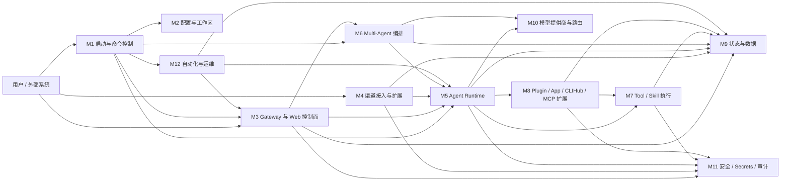

### 2.4 全局主链路总泳道图

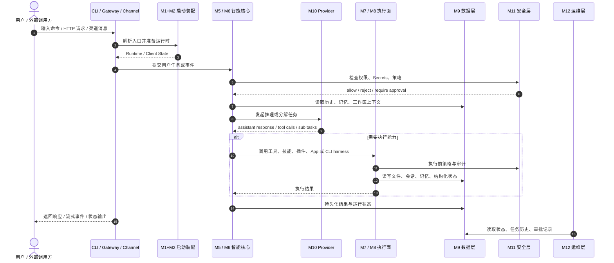

## 3. 模块详细设计

### 3.1 M1 启动与命令控制模块

**目录范围**

- `cmd/anyclaw/main.go`
- `cmd/anyclaw/*.go`
- `pkg/runtime/`

**职责**

1. 解析 root flags 和所有子命令，例如 `gateway`、`task`、`models`、`channels`、`cron`、`app`、`mcp`。
2. 统一决定当前命令走本地执行、gateway-first、守护进程、一次性任务还是运维模式。
3. 负责调用 `pkg/runtime.Bootstrap`，把配置、工具、技能、插件、模型客户端、Agent 和 Orchestrator 装配成可运行状态。
4. 管理控制台交互、信号退出、配置覆写、启动提示和根命令别名归一化。

**边界**

1. M1 负责“把系统启动起来”和“把命令派发对地方”，但不拥有具体的推理、协议适配或工具实现。
2. M1 可以更新配置，但不负责配置模型本身的 schema 定义和默认值生成，那属于 M2。
3. M1 可以连接 Gateway 客户端，但不直接承担长生命周期的 HTTP / WebSocket 控制面，那属于 M3。

**上下游协作**

- 上游输入来自终端参数、环境变量、stdin 和系统信号。
- 下游最常调用 M2 加载配置，调用 M3 启动或连接 Gateway，调用 M5 / M6 执行本地任务，调用 M12 输出状态和运维信息。
- 对用户来说，M1 是“整个系统的入口解释器”。

**模块泳道图**

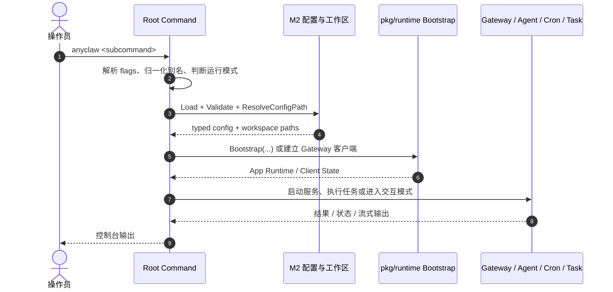

### 3.2 M2 配置与工作区模块

**目录范围**

- `pkg/config/`
- `pkg/workspace/`
- `workflows/`
- `anyclaw.json`

**职责**

1. 定义 `Config`、`LLMConfig`、`AgentConfig`、`GatewayConfig`、`PluginsConfig` 等类型化配置结构。
2. 负责默认值填充、路径解析、环境变量覆写、Provider Profile 与 Agent Profile 的落地。
3. 负责工作区引导文件生成，例如 `AGENTS.md`、`SOUL.md`、`TOOLS.md`、`MEMORY.md` 等。
4. 为运行时提供一个稳定的“本地上下文根”，让 Agent 知道自己该在哪个工作区执行、该加载哪些工作区文件。

**边界**

1. M2 只负责“准备静态运行上下文”，不负责长时间运行的网络服务、渠道连接和模型调用。
2. M2 不拥有记忆检索和会话读写逻辑，它只负责把目录和文件脚手架准备好。
3. M2 不负责策略裁决；它产出的是配置与上下文，真正执行时的权限判断由 M11 完成。

**上下游协作**

- M1 启动时最先调用 M2。
- M5 在构建系统 Prompt 时会再次读取 `workflows/` 中的引导文件。
- M9 会使用 M2 产出的工作区目录，把持久化数据落到约定路径。

**模块泳道图**

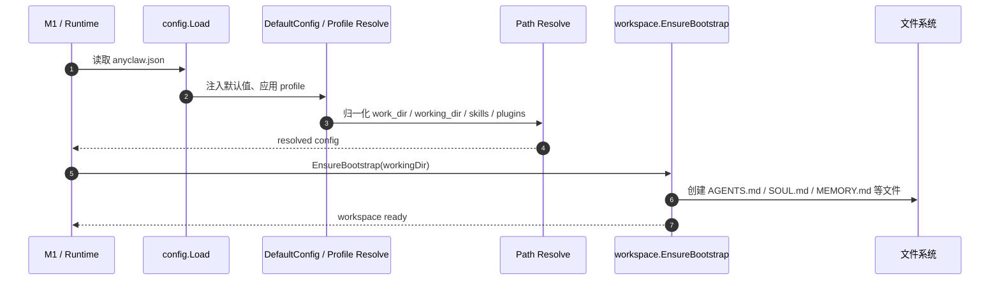

### 3.3 M3 Gateway 与 Web 控制面模块

**目录范围**

- `pkg/gateway/`
- `ui/`
- `cmd/anyclaw/gateway_cli.go`
- `cmd/anyclaw/gateway_http.go`
- `cmd/anyclaw/status_cli.go`

**职责**

1. 提供 HTTP / WebSocket 控制面，为 Dashboard、桌面壳或外部客户端暴露入口。
2. 承担 `status`、`health`、`sessions`、`approvals`、`events` 等控制面查询路径。
3. 支持 gateway-first 运行方式，让根命令优先连接 Gateway，而不是总是本地直接执行。
4. 管理客户端连接、推送事件和服务生命周期。

**边界**

1. M3 是控制面，不是智能决策核心。它可以承接请求，但不拥有 Prompt、Tool Loop 和分解算法。
2. M3 负责连接状态、请求路由和响应输出，不负责长期记忆语义本身。
3. M3 可以查询 M9 和触发 M5 / M6，但不替代这些模块的内部逻辑。

**上下游协作**

- UI、桌面端和脚本客户端通过 M3 接入系统。
- M3 把真正的任务执行委托给 M5 / M6，把状态查询委托给 M9 / M12。
- M11 在 Gateway 层承担 API token、事件保护、审批接口等安全职责。

**模块泳道图**

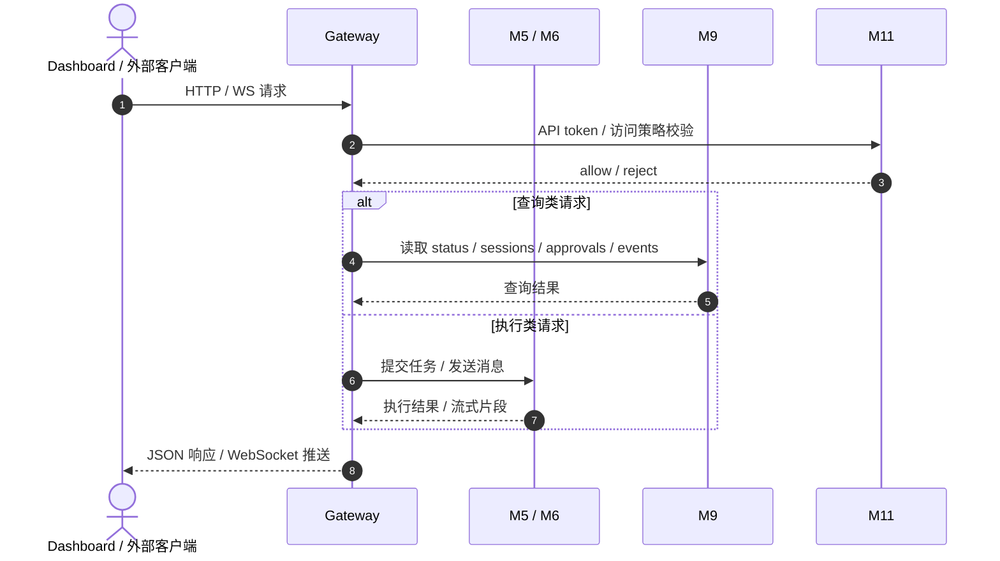

### 3.4 M4 渠道接入与扩展模块

**目录范围**

- `pkg/channel/`
- `pkg/channels/`
- `extensions/`
- `pkg/channels/security_policy.go`
- `pkg/channels/routing.go`

**职责**

1. 把 Telegram、Slack、Discord、WhatsApp、Signal 等外部平台协议统一抽象为内部入站消息。
2. 维护渠道适配器生命周期、健康状态、运行状态和最近活动时间。
3. 在消息进入智能核心之前做渠道级接入门控、渠道安全策略和基础路由处理。
4. 把内部产出的回复重新转换成对应平台可发送的消息格式。

**边界**

1. M4 不拥有 Prompt 构建和模型推理，它只负责“把外部消息送进来”和“把结果发回去”。
2. M4 可以做渠道级身份、安全和会话映射，但不负责单 Agent 或多 Agent 推理决策。
3. 扩展目录 `extensions/` 体现的是平台生态，不应反向侵入 M5 的推理内核。

**上下游协作**

- 上游是外部平台 webhook、polling 或 WebSocket 连接。
- 下游通常把消息交给 M5；如果未来有更复杂的分配策略，也可以经由 M6。
- M11 会在这里生效，例如 DM 策略、allow list、pairing 和 risk acknowledgment。

**模块泳道图**

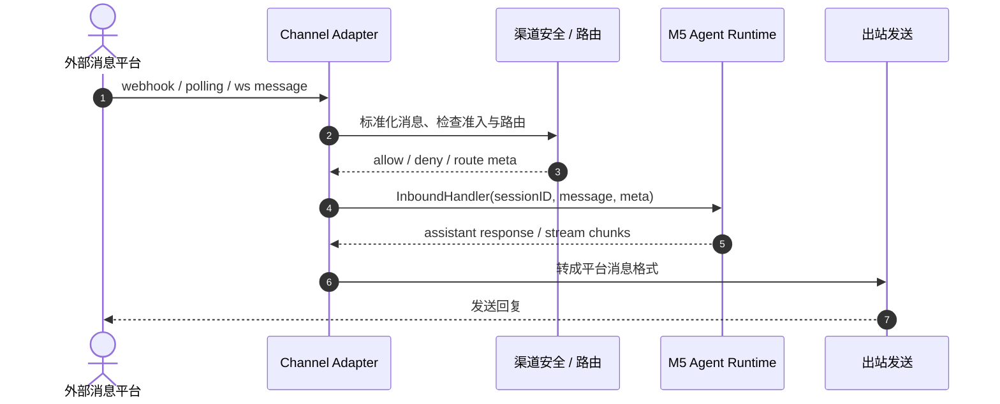

### 3.5 M5 Agent Runtime 模块

**目录范围**

- `pkg/agent/`
- `pkg/prompt/`
- `pkg/context/`
- `pkg/context-engine/`
- 与 Agent 直接交互的 `workspace`、`memory`、`tools` 接口

**职责**

1. 承担单 Agent 的完整执行闭环：读用户输入、构造系统 Prompt、调用模型、执行 Tool Call、回写历史和记忆。
2. 负责工作区 Bootstrap Ritual、CLIHub 意图自动路由、工具活动记录、上下文压缩和 Token 预算控制。
3. 管理对话历史、工作区引导文件注入、技能系统提示注入和工具定义装配。
4. 作为“最小可执行智能单元”存在，所有复杂执行最终都要落到 Agent 的实际运行逻辑上。

**边界**

1. M5 是单 Agent 执行器，不负责把一个复杂任务拆成多个子任务，那属于 M6。
2. M5 使用 M7 / M8 的能力，但不拥有工具和插件的注册发现逻辑。
3. M5 依赖 M10 完成模型请求，但不拥有 Provider 适配细节。
4. M5 会把结果写回 M9，但不直接定义记忆后端的存储结构。

**上下游协作**

- M1、M3、M4、M12 都可能把任务提交给 M5。
- M5 是最常见的“智能内核入口”，M6 的子代理最终也是以类似的 Agent 执行方式运行。
- M5 读取 M2 的工作区文件，使用 M7 / M8 执行动作，读取和写回 M9，调用 M10，并受 M11 约束。

**模块泳道图**

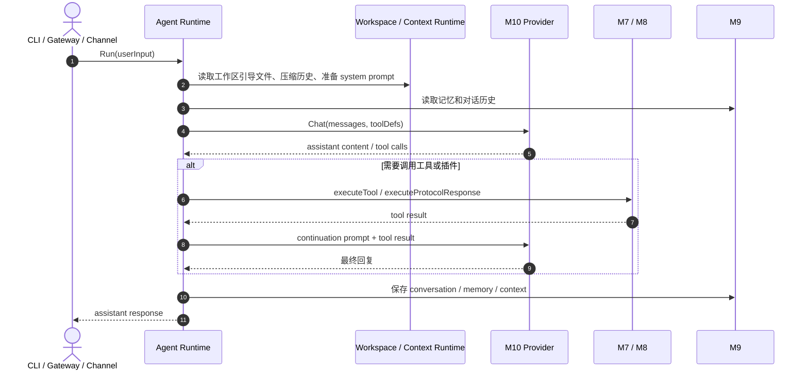

### 3.6 M6 Multi-Agent 编排模块

**目录范围**

- `pkg/orchestrator/`
- `pkg/agents/`
- `pkg/agentstore/`

**职责**

1. 在任务过于复杂或配置明确启用时，对任务进行分解、分配和依赖调度。
2. 维护 Agent Pool、Task Queue、Agent Lifecycle 和编排日志。
3. 根据 AgentDefinition / AgentCapability 选择子代理，并支持并发执行子任务。
4. 聚合各子任务结果，生成最终的汇总响应。

**边界**

1. M6 是调度者，不是实际执行者。真正执行每个子任务的仍然是具体的 SubAgent / Agent。
2. M6 不负责 HTTP、渠道协议、终端 UI 或工作区引导文件生成。
3. M6 不自己实现工具，只负责把子任务交给拥有相应能力的执行单元。
4. 当前编排能力是可选层，不是所有路径都会经过 M6。

**上下游协作**

- 上游通常来自 M1 的 `task run`、未来的 Gateway 复杂任务或系统内部需要分解的工作。
- 下游依赖 M5 的子代理执行、M9 的任务状态、M10 的规划模型和 M7 的实际能力。
- M6 适合承接“谁来做”“先做什么”“并发还是串行”这类问题。

**模块泳道图**

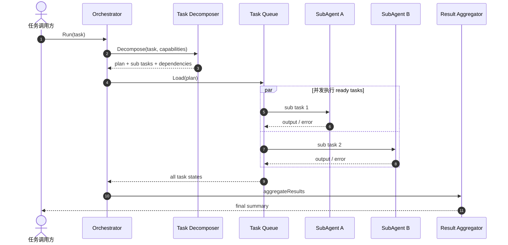

### 3.7 M7 Tool / Skill 执行模块

**目录范围**

- `pkg/tools/`
- `pkg/skills/`

**职责**

1. 维护统一的 `Registry`，为 Agent 暴露结构化工具定义和调用入口。
2. 提供内置工具族，包括文件、命令、Web、Browser、Desktop、Memory、QMD 等执行能力。
3. 把技能目录中的内容装载进工具注册表，让技能成为可调用能力。
4. 在实际调用前后应用超时、缓存、策略、沙箱、危险命令确认和审计。

**边界**

1. M7 是能力执行层，不拥有用户请求语义，也不负责决定“为什么要调用这个工具”。
2. M7 对上暴露的是稳定的工具接口，对下连接真实的本地能力、浏览器、桌面和状态存储。
3. M7 不负责插件 manifest 的发现与信任校验，那属于 M8。
4. M7 不负责长期状态设计，但会把执行结果写入 M9。

**上下游协作**

- M5 通过 `ToolDefinition` 和 `Registry.Call` 使用 M7。
- M11 的策略引擎、受保护路径和沙箱是 M7 的执行前置条件。
- M8 注册进来的 Tool / App plugin 最终也会通过 M7 暴露给 Agent。

**模块泳道图**

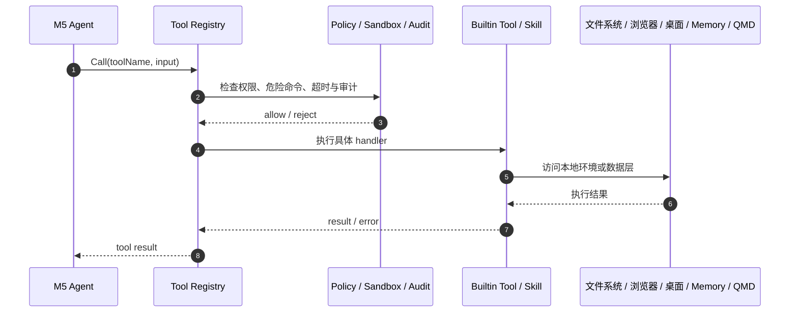

### 3.8 M8 Plugin / App / CLIHub / MCP 扩展模块

**目录范围**

- `pkg/plugin/`
- `pkg/apps/`
- `pkg/clihub/`
- `pkg/mcp/`
- `plugins/`

**职责**

1. 扫描插件目录，加载 manifest，并对签名、trust、permission、timeout 等元数据做统一管理。
2. 把 Tool Plugin、Channel Plugin、Ingress、Surface、App Connector 这些扩展能力注册进系统。
3. 维护 App Binding、Pairing、UI Map 和工作流匹配，让 AnyClaw 能把自然语言任务落到应用级 workflow 上。
4. 读取本地 CLI-Anything 目录，把现成的 CLI harness 暴露为可执行能力。
5. 提供 MCP server / tools 能力，让 AnyClaw 也能以 MCP 形式被外部系统使用。

**边界**

1. M8 是扩展面，不是基础执行面。它负责“把外部能力接进来”，但真正调用时仍然通过 M7 或协议执行器落地。
2. M8 可以运行外部可执行程序，但不自己决定任务何时调用它们；这一决策来自 M5 / M6。
3. M8 不负责模型路由，也不直接承担全局配置装配。
4. App Store 和 Pairing Store 属于扩展上下文，不替代核心 Memory / Session 存储。

**上下游协作**

- M5 在识别到 App workflow、desktop plan、CLIHub 意图或 MCP 入口时会使用 M8。
- M8 通过 M7 暴露能力，通过 M9 存绑定和运行状态，通过 M11 执行 trust / permission 门控。
- 这个模块是 AnyClaw 走向“平台化”最关键的扩展接口层。

**模块泳道图**

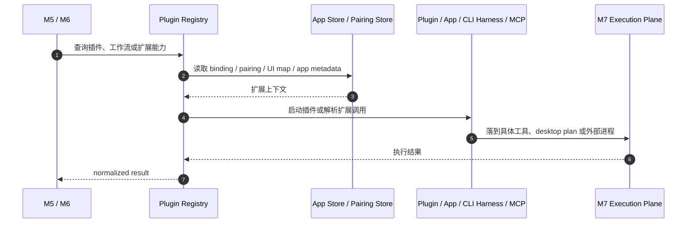

### 3.9 M9 状态与数据模块

**目录范围**

- `pkg/memory/`
- `pkg/qmd/`
- `pkg/sessionstore/`
- `./.anyclaw/`
- `workflows/memory/`
- `pkg/apps/store.go` 等本地状态文件

**职责**

1. 提供长期记忆、全文检索、向量检索、混合检索和每日记忆文件。
2. 提供轻量结构化状态层 QMD，用于存放表格化运行状态和结构化记录。
3. 提供会话管理器，维护 session 的状态、历史、活跃时间和持久化文件。
4. 承担 App Binding、Pairing、UI Map、Gateway 状态、Secrets Store、审计日志等文件化状态的落盘位置。

**边界**

1. M9 的职责是保存、检索和组织状态，而不是解释状态。
2. M9 不决定是否要调用某个工具，也不决定用户意图如何理解。
3. M9 只提供数据服务；调用顺序、重试和业务闭环由上游模块负责。

**上下游协作**

- M5 会读写 conversation、memory 和 context 相关数据。
- M6 依赖 M9 保存子任务结果和执行日志背景。
- M7 / M8 会把工具结果、App binding、desktop plan 状态等写回 M9。
- M12 则大量读取 M9 来生成状态、历史和运维视图。

**模块泳道图**

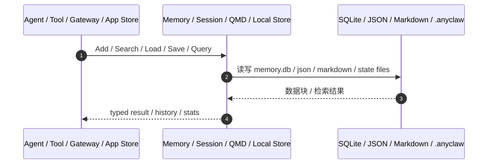

### 3.10 M10 模型提供商与路由模块

**目录范围**

- `pkg/llm/`
- `pkg/providers/`
- `pkg/routing/`

**职责**

1. 提供统一的 `ClientWrapper` 和消息协议，把不同 Provider 适配成统一接口。
2. 支持普通对话、流式返回、tool call、图片块、OpenAI-compatible base URL 等模型层能力。
3. 根据配置和路由策略选择模型，例如复杂任务走 reasoning provider，简单请求走 fast provider。
4. 对 M5 / M6 暴露一个统一的“会说话且会返回工具调用”的模型客户端。

**边界**

1. M10 负责“如何和模型说话”，不负责“什么时候调用哪个工具”。
2. M10 不拥有工作区、文件系统、记忆或审计逻辑。
3. M10 不直接面对终端用户或 HTTP 客户端，它始终被上层运行时调用。

**上下游协作**

- M5 用 M10 执行常规单 Agent 推理。
- M6 的 decomposer 也依赖 M10 完成任务拆解。
- M1 的 `/set provider`、`/set model` 与 `routing.DecideLLM` 会影响 M10 的运行选择。

**模块泳道图**

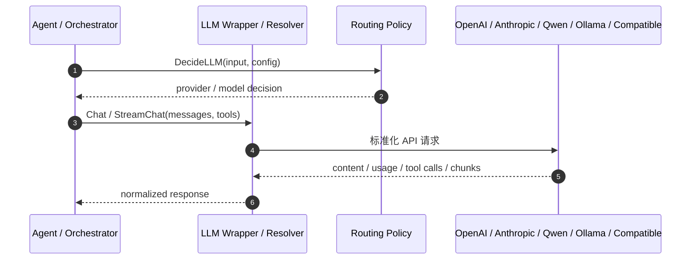

### 3.11 M11 安全、Secrets 与审计模块

**目录范围**

- `pkg/security/`
- `pkg/secrets/`
- `pkg/audit/`
- `pkg/tools` 中 policy / sandbox
- `pkg/channels/security_policy.go`

**职责**

1. 管理 API token、Webhook Secret、LLM / Provider Secret 的激活与存储。
2. 定义危险命令模式、受保护路径、允许读写路径、允许外连域名等策略边界。
3. 在工具执行前实施权限检查、危险命令确认和沙箱管理。
4. 为 Gateway、渠道和工具调用写审计日志，为审批体系提供前置约束。
5. 为插件与扩展执行提供 trust / signer / permission 维度的治理。

**边界**

1. M11 是守门员，不是执行者。它做 allow / deny / record，而不是生成业务答案。
2. M11 不定义用户要做什么任务，只决定任务在当前环境里是否允许这样做。
3. M11 是横切模块，会出现在 M3、M4、M7、M8 等多个关键节点上。

**上下游协作**

- M3 在 API token 和控制面保护上依赖 M11。
- M4 在渠道准入、pairing 和 DM 政策上依赖 M11。
- M7 / M8 在执行前策略校验、受保护路径和外部命令门控上依赖 M11。
- 审批和审计结果最终会被 M12 用于运维观察。

**模块泳道图**

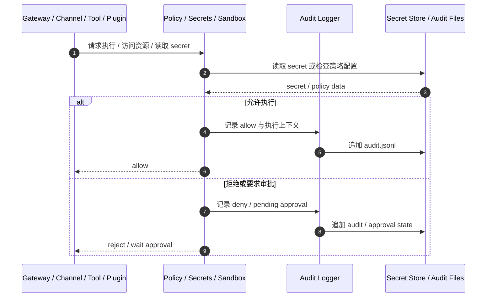

### 3.12 M12 自动化与运维模块

**目录范围**

- `pkg/cron/`
- `cmd/anyclaw/status_cli.go`
- `cmd/anyclaw/cron_cli.go`
- `cmd/anyclaw/main.go` 中 `doctor` / `onboard`
- `cmd/anyclaw/store_cli.go`

**职责**

1. 提供状态查询、健康检查、会话列表、审批处理和运行态观察能力。
2. 提供 Cron scheduler、任务历史、立即触发、启停和运行统计。
3. 承担 Onboard、Doctor 这类面向安装与诊断的运维入口。
4. 为操作者提供“系统现在是什么状态、为什么失败、下一次会做什么”的运维视角。

**边界**

1. M12 更像 sidecar 运维平面，不直接参与常规单轮推理闭环。
2. M12 会读取或触发其他模块，但不替代 M5 的智能执行，也不替代 M9 的数据存储。
3. 当前 Cron 配置路径相对独立，更多通过 `cron_cli.go` 和调度器自己管理，和核心 typed config 的耦合度比 M1~M11 更低。

**上下游协作**

- 运维命令主要通过 M3、M9 和 M11 读取状态。
- 定时任务会在到点时触发 M5 执行实际任务，并把历史写回 M9。
- M12 是排障时最直接的观察面，但不是系统智能的来源。

**模块泳道图**

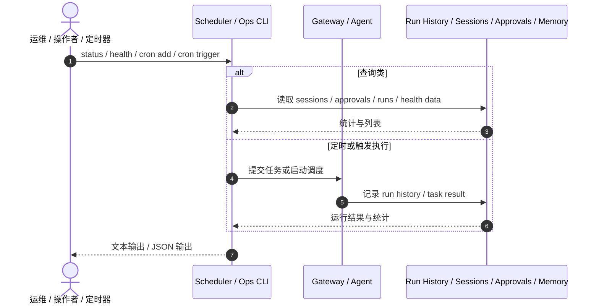

## 4. 关键端到端运行链路

### 4.1 本地交互模式链路

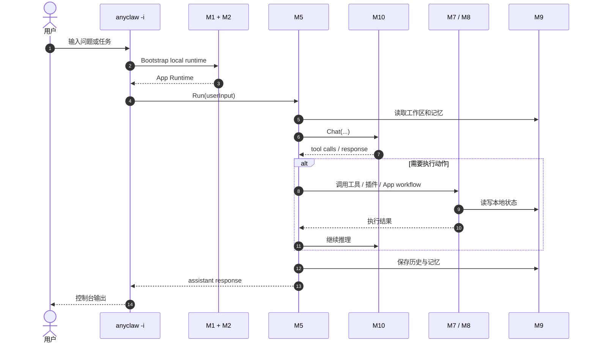

### 4.2 Gateway / Dashboard 请求链路

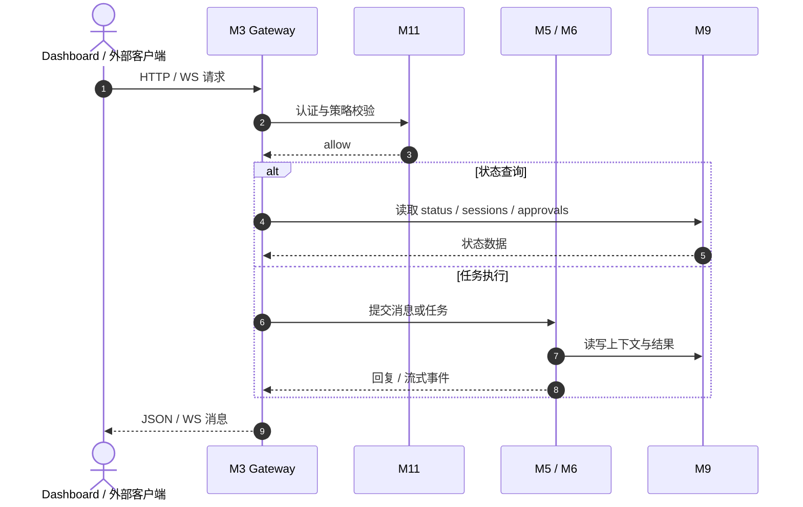

### 4.3 渠道消息入站链路

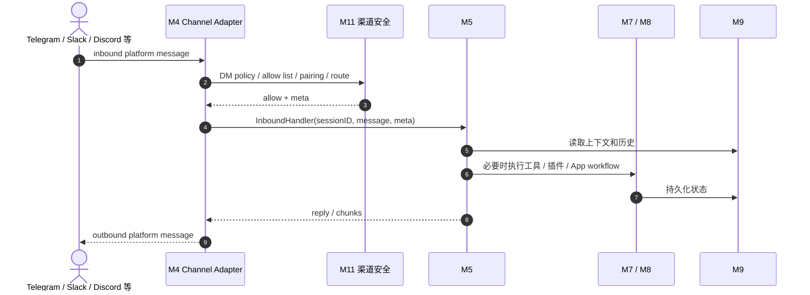

### 4.4 Multi-Agent 复杂任务链路

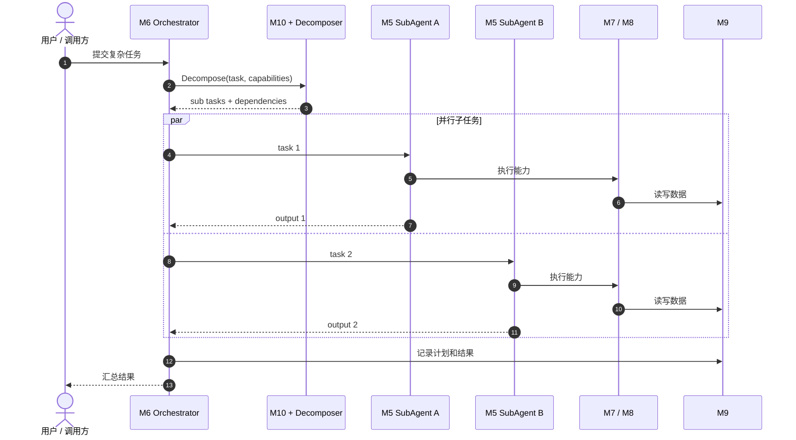

### 4.5 App Workflow / Desktop Plan 执行链路

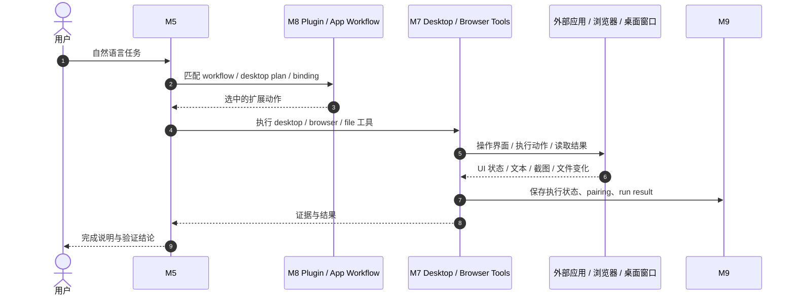

### 4.6 Cron 与运维链路

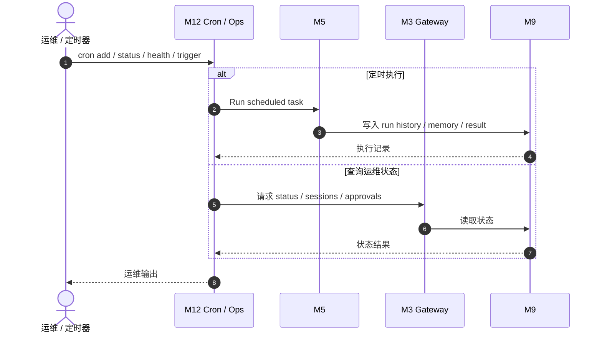

## 5. 模块边界总结

### 5.1 责任矩阵

| 问题类型 | 首要负责模块 | 不应由谁主导 |
|------|------|------|
| 命令解析、模式选择、进程启动 | M1 | M5 / M7 |
| 配置 schema、默认值、工作区引导文件 | M2 | M1 / M3 |
| HTTP / WS 控制面、Dashboard、gateway-first | M3 | M5 / M10 |
| 外部 IM 协议接入与平台转换 | M4 | M5 / M7 |
| 单 Agent 推理与 Tool Loop | M5 | M3 / M7 |
| 多 Agent 分解、并发调度、汇总 | M6 | M5 单独承担 |
| 工具、技能、本地执行能力 | M7 | M5 / M10 |
| 插件、App workflow、CLI harness、MCP | M8 | M7 基础层 |
| 记忆、会话、结构化状态、本地落盘 | M9 | M5 / M3 |
| Provider 适配、模型切换、路由决策 | M10 | M7 / M9 |
| 权限、Secrets、沙箱、审计、审批前置 | M11 | M5 / M7 |
| 定时任务、状态查询、健康检查、运维观察 | M12 | M5 / M9 |

### 5.2 依赖方向原则

1. 外围模块向内依赖：CLI、Gateway、Channels 都是入口，它们把请求送到智能核心，而不是自己做推理。
2. 智能核心向下依赖：M5 / M6 调用 M7 / M8 取得执行能力，调用 M9 取得状态，调用 M10 取得模型能力。
3. 安全层横切插入：M11 不主导业务流，但会插在控制面、渠道面和执行面之前。
4. 运维层绕核心观察：M12 读取状态、调度任务、执行诊断，但不改变核心模块的职责边界。

## 6. 阅读建议

如果你是从问题排查出发，可以按下面路径阅读代码：

- 启动失败或命令行为不对：先看 M1，再看 M2。
- Dashboard / Gateway 不通：先看 M3，再看 M11。
- 渠道收不到消息或回不去：先看 M4，再看 M11。
- Agent 回答逻辑不对或工具循环异常：先看 M5，再看 M7 / M10。
- 复杂任务拆分不对：先看 M6，再看 M5 / M10。
- 插件、App workflow、CLIHub、MCP 有问题：先看 M8，再看 M7 / M11。
- 记忆、会话、状态落盘异常：先看 M9。
- 模型切换、Provider、路由异常：先看 M10。
- 权限、危险命令、Secrets、审批异常：先看 M11。
- Cron、状态面板、审批列表、健康检查异常：先看 M12。

## 7. 结论

AnyClaw 当前已经不是“一个带命令行的聊天机器人”，而是一套明确分层的本地 Agent 平台：

1. M1~M4 负责入口、控制面和接入面。
2. M5~M6 负责智能执行核心。
3. M7~M8 负责能力与扩展执行面。
4. M9~M11 负责数据、模型和治理底座。
5. M12 负责自动化与运维观察。

理解 AnyClaw 时，最重要的不是记住目录名，而是记住一句话：入口把任务送进来，智能核心做决策，能力平面去执行，数据层落状态，安全层做守门，运维层做观察与调度。只要这条主线不乱，模块边界就不会乱。
